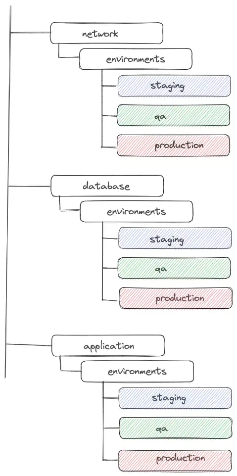

# Terraform


## Terraform이란?
- code를 통해 infrastructure를 구성하고 관리할 수 있도록 해주는 open source tool
- 기본적으로 HCL(HashiCorp Configuration Language)을 사용하여 code를 작성할 수 있으며 json으로도 가능함
- 작성된 코드를 통해 infrastructure resource들을 생성, 변경, 삭제를 할 수 있음


## Terraform 장점
- open source이고 IaC를 위한 도구로 많은 사람들이 이용하고 있기 때문에 문제가 생겼을 시 검색하여 쉽게 해결법을 찾을 수 있고, 다양한 이슈들에 대해서 활발히 수정 및 업데이트가 진행되고 있음
- Terraform code를 Git으로 관리한다면 기존에는 하기 힘든 infrastructure 구성 history를 관리할 수 있음
- code로 관리되기 때문에 특정 resource를 추가하기 위해 적용 전에 다른 사람들의 리뷰를 받을 수 있음
- 기존 code를 재사용함으로 추가적으로 동일한 resource를 만들 때 쉽고 빠르게 적용할 수 있음


## Terraform modules


### module이란?
- 한 개 또는 여러 개의 `.tf` 또는 `.tf.json`파일들로 구성되어 있으며, module에 따라 한 개 또는 여러 개의 resource들을 포함
- module 내 파일들은 한 개의 directory에 모두 위치
- 여러 resource들을 포함하고 있는 module을 만들어서 원하는 곳에서 원하는 resource들을 생성하거나, 필요한 정보를 가져올 수 있음


#### Root module
- Terraform command를 수행하는 directory에 있는 파일들로 구성된 module


#### Child module
- Root module을 포함한 다른 module에서 호출하여 사용되는 module
- 여러 번 호출되어 사용될 수 있고 module에 따라 다른 configuration 값을 전달하여 사용할 수도 있음


### module 사용 방법
- `module` block에 unique한 이름을 명시하여 사용


#### module arguments


##### `source`
- 사용하고자 하는 module을 어디에서 가져올 건지 명시
- 모든 module은 반드시 `source` 값을 명시해야 함
- 같은 `source` 값을 가지는 `module` block을 다른 variable 값을 통해 여러 번 사용하는 것이 가능
- module을 처음 사용 시 `terraform init`을 통해 해당 module을 install하는 과정이 반드시 필요
- `source`의 값으로 사용할 수 있는 것
    - local path
        - local에 저장되거나 직접 만든 module을 사용
        - `./` 또는 `../`을 사용할 수 있고 해당 module의 경로를 지정하면 됨
    - Terraform Registry
        - Terraform module 저장소
        - 다양한 module들이 있고, 모든 module들은 public으로 관리
        - Terraform Cloud나 Terraform Enterprise를 사용한다면 Terraform Registry를 private로 사용 가능
        - 인증 받은 module을 사용하는 것이 안전하다
    - Github
        - Github에 올려져 있는 module을 가져와서 사용하는 것도 가능
        - HTTPS를 통해 clone하여 사용할 수 있음
            - `github.com/hashicorp/example`
        - SSH를 통해 clone하여 사용할 수도 있음
            - `git@github.com:hashicorp/example.git`
    - Bitbucket
        - `bitbucket.org/hashicorp/example`
    - Git Repository
        - Github이나 Bitbucket으로 관리되지 않는 Git Repository에 대해서도 사용이 가능
        - HTTPS
            - `git::https://example.com/example.git`
        - SSH
            - `git::ssh://username@example.com/example.git`
        - Git Repository를 module로 사용 시에는 default branch를 기본으로 사용하는데, `ref` argument를 사용하여 원하는 branch 또는 tag를 사용하는 것이 가능
            - other branch
                - `git::https://example.com/example.git?ref=other_branch`
            - tag
                - `git::https://example.com/example.git?ref=tag_name`
    - S3 Bucket
        - AWS S3 Bucket에 저장되어 있는 module도 `source`로 사용 가능
            - `s3::https://s3-eu-west-1.amazonaws.com/example/example.zip`
            - 위와 같이 `s3` prefix를 통해 접근이 가능하며, 해당 module의 install을 위해서는 AWS credentials setting이 되어 있어야 함
    - GCS Bucket
        - Google Cloud Storage에 저장된 module도 `source`로 사용 가능
            - `gcs::https://www.googleapis.com/storage/v1/modules/example.zip`
            - 위와 같이 `gcs` prefix를 통해 접근이 가능하며, 다음과 같은 규칙을 가짐
            `gcs::https://www.googleapis.com/storage/v1/BUCKET_NAME/PATH_TO_MODULE`
            - GCS에 저장된 module의 install을 위해서는 역시 credentials setting이 되어 있어야 함


##### input variable arguments
- module 사용 시에 Child module이 가지고 있는 input variables가 있다면 Parent module에서 해당 값들을 argument로 명시하여 configuration이 가능
- 예제
    - Child module
        - main.tf
            ```
            resource "aws_security_group" "example" {
                name        = var.name
                description = var.description
            }
            ```
        -  variables.tf
            ```
            variable "name" {
                type = string
            }
            
            variable "description" {
                type    = string
                default = null
            }
            ```
    - Parent module
        ```
        module "example" {
            source      = "./module"
            name        = "example"
            description = "example"
        }
        ```
- 예제에서 확인할 수 있듯이 Child module의 `name`, `description` input variables가 Parent module에서 argument로 사용되어 값을 전달받고 있다는 것을 확인할 수 있음
- `name`의 경우에는 필수 값으로 Parent module에서 명시하지 않으면 error가 발생하지만, `description`의 경우에는 optional 값으로 module 사용 시에 명시하지 않아도 문제 없이 default 값으로 설정


## Terraform directory structure
- 관점에 따라 다르게 directory structure strategy를 세울 수 있음


### [1] environment 별로 나뉜 directory structure
- 상위 directory를 environment별로 나누는 방법


#### 장점
- 환경별로 독립적이고 구분이 가능함
- 환경별 계층을 세분화하여 커스터마이징할 수 있음
- 원하지 않는 환경에 리소스를 생성하는 실수를 줄일 수 있음


#### 단점
- 새로운 환경을 구성할 때 파일이 중복되는 것은 불가피함
- 하위 디렉토리 레벨이 깊어질 수 있음


### [2] component 별로 나뉜 directory structure
- 상위 directory를 component별로 나누는 방법





#### 장점
- 반복되는 환경에서 확장성이 있음
- 단순함


#### 단점
- 원하지 않는 환경에 리소스를 생성하는 실수가 발생할 수 있음
- 환경별 계층을 커스터마이징하는 것이 불분명함


# 출처
- [Terraform 이란?](https://velog.io/@gentledev10/what-is-the-terraform)
- [Terraform modules 사용 방법](https://velog.io/@gentledev10/terraform-modules)
- [How to Create Terraform Multiple Environments](https://getbetterdevops.io/terraform-create-infrastructure-in-multiple-environments/)