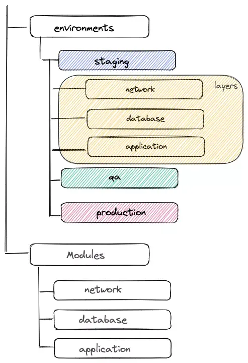
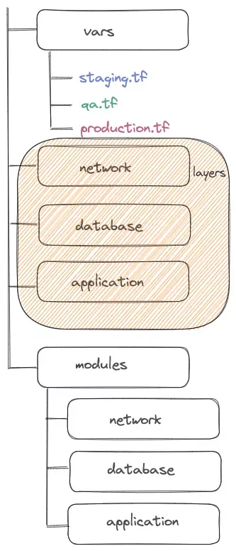

# Terraform

## Terraform이란?
- Code를 통해 Infrastructure를 구성하고 관리할 수 있도록 해주는 Open Source Tool
- 기본적으로 HCL(HashiCorp Configuration Language)을 사용하여 Code를 작성할 수 있으며 Json으로도 가능함
- 작성된 코드를 통해 Infrastructure Resource들을 생성, 변경, 삭제를 할 수 있음

## Terraform 장점
- Open Source이고 IaC를 위한 도구로 많은 사람들이 이용하고 있기 때문에 문제가 생겼을 시 검색하여 쉽게 해결법을 찾을 수 있고, 다양한 이슈들에 대해서 활발히 수정 및 업데이트가 진행되고 있음
- Terraform Code를 Git으로 관리한다면 기존에는 하기 힘든 Infrastructure 구성 History를 관리할 수 있음
- Code로 관리되기 때문에 특정 Resource를 추가하기 위해 적용 전에 다른 사람들의 리뷰를 받을 수 있음
- 기존 Code를 재사용함으로 추가적으로 동일한 Resource를 만들 때 쉽고 빠르게 적용할 수 있음

## Terraform Directory Structure
- 관점에 따라 

### Environment 별로 나뉜 Directory Structure
- 상위 Directory를 Environment 별로 나누는 방법

### Component 별로 나뉜 Directory Structure
- 상위 Directory를 Component 별로 나누는 방법

# 출처
- [Terraform 이란?](https://velog.io/@gentledev10/what-is-the-terraform)
- [How to Create Terraform Multiple Environments](https://getbetterdevops.io/terraform-create-infrastructure-in-multiple-environments/)