# Spring 입문
  

## Spring 프로젝트 생성
  

### 사전 준비물
- Java 11
- IDE: IntelliJ or Eclipse
  

### Spring Initializr
- [start.spring.io](https://start.spring.io/)
  - 생성할 프로젝트 설정
    - Project: Gradle Project
    - Language: Java
    - Spring Boot: 2.7.2
    - Project Metadata
      - group: hello
      - Artifact: hello-spring
      - Java: 11
    - Dependencies: Spring Web , Thymeleaf
  - 설정 완료 후 Generate 클릭
  - zip 파일 다운로드 완료 후 압축 해제
  - IntelliJ 실행 후 압축 해제한 디렉토리 열기  

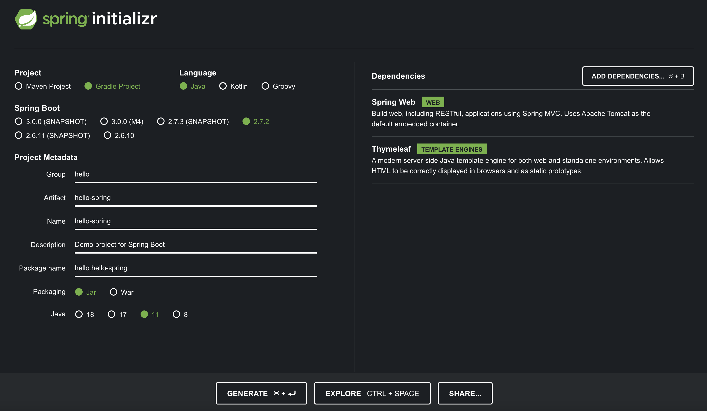
  

## Spring 프로젝트 실행
- `src/main/java/hello.hellospring/HelloSpringApplication.java` 파일 열기
- `main` 메서드 실행
- 웹 브라우저에 `http://localhost:8080` 입력
- **Whitelabel Error Page** 에러 페이지가 나타나는 것으로 동작 확인  

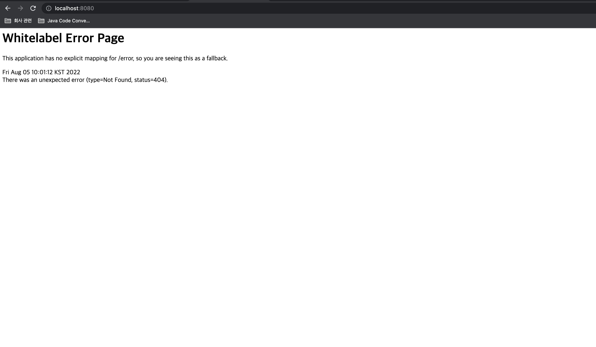
  

## IntelliJ에서 Gradle 대신에 Java로 직접 실행하도록 설정
> 최근 IntelliJ는 로컬에 설치된 Gradle을 통해서 실행하는 것이 기본 설정으로 되어 있다. 이렇게 하면 실행 속도가 느리다.  
아래와 같이 변경하면 Java로 바로 실행해서 실행속도가 더 빠르게 할 수 있다.
- Preferences -> Build, Execution, Deployment -> Build Tools -> Gradle
  - Build and run using: Gradle -> IntelliJ IDEA
  - Run tests using: Gradle -> IntelliJ IDEA  
  
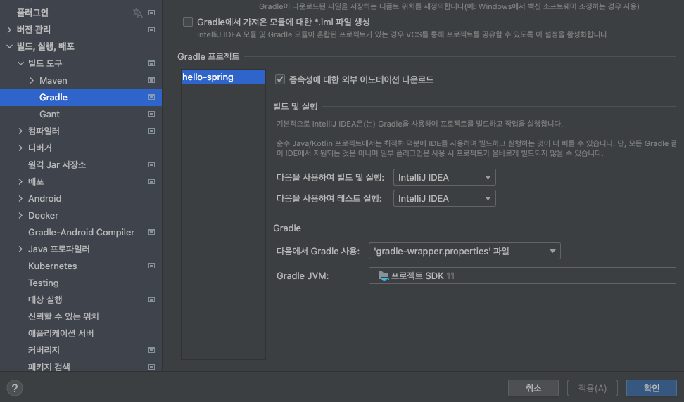
  

## 라이브러리 살펴보기
> Gradle은 의존 관계가 있는 라이브러리를 함께 다운로드한다.
  

### Spring Boot Library
- spring-boot-starter-web
  - spring-boot-starter-tomcat: 톰캣 (웹 서버)
  - spring-webmvc: Spring 웹 MVC
- spring-boot-starter-thymeleaf: 타임리프 Template 엔진 (View)
- spring-boot-starter(공통): Spring Boot + Spring Core + Logging
  - spring-boot
    - spring-core
  - spring-boot-starter-logging
    - logback, slf4j
  

### Test Library
- spring-boot-starter-test
  - junit: 테스트 프레임워크
  - mockito: mock 라이브러리
  - assertj: 테스트 코드를 좀 더 편하게 작성하게 도와주는 라이브러리
  - spring-test: Spring 통합 테스트 지원
  

## View 환경설정
  

### Welcome Page 만들기
- Spring Boot가 제공하는 Welcome Page 기능
  - `static/index.html`을 올려두면 Welcome Page 기능을 제공
  - [Welcome Page: Spring Boot Reference Documentation](https://docs.spring.io/spring-boot/docs/current/reference/htmlsingle/#web.servlet.spring-mvc.welcome-page)
  

### thymeleaf Template 엔진
- 동작 확인
  - 웹 브라우저에 `http://localhost:8080/hello` 입력
  - 아래와 같은 페이지가 나오는 것으로 동작 확인  

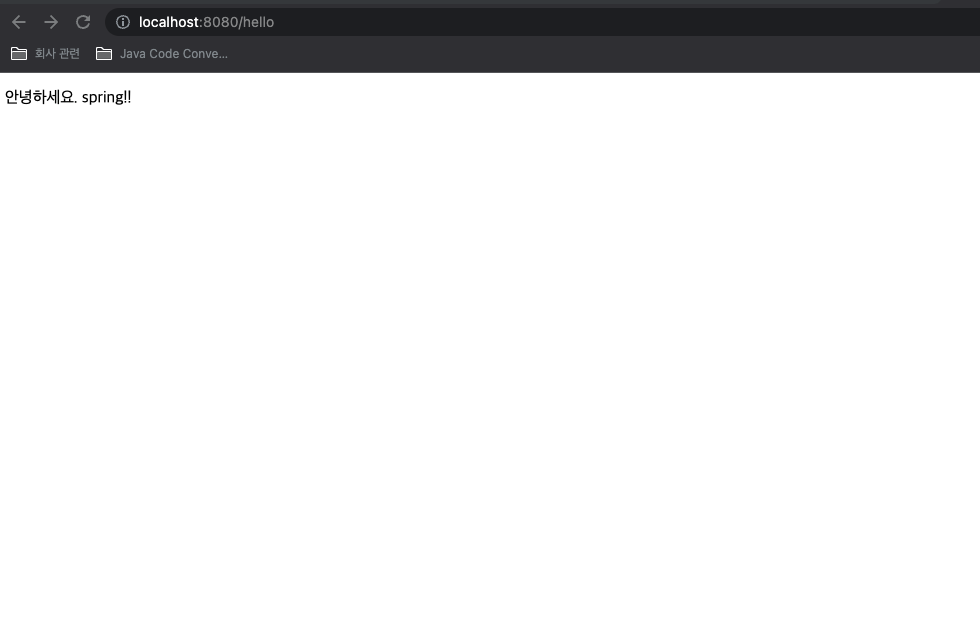
  

- 동작 환경
  - *Controller*에서 Return 값으로 문자를 반환하면 *viewResolver*가 화면을 찾아서 처리
  - Spring Boot Template 엔진 기본 viewName 매핑
    - `resources:templates/` + **{ViewName}** + `.html`  

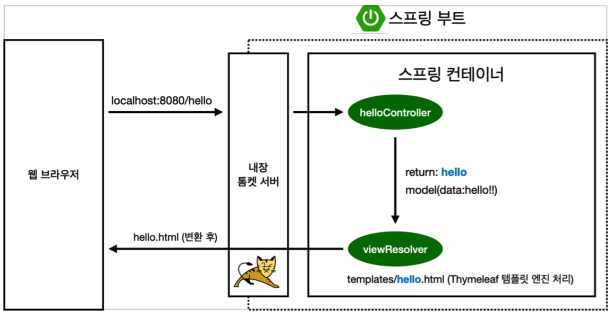
  
  
- 관련 문서
  - [thymeleaf 공식 사이트](https://www.thymeleaf.org/)
  - [스프링 공식 튜토리얼](https://spring.io/guides/gs/serving-web-content/)
  - [스프링 부트 매뉴얼](https://docs.spring.io/spring-boot/docs/current/reference/htmlsingle/#web.servlet.spring-mvc.template-engines)
  

## 빌드하고 실행하기
- `./gradlew build`
- `cd build/libs`
- `java -jar hello-spring-0.0.1-SNAPSHOT.jar`
- 동작 확인
  

## Spring 웹 개발 기초
  

### 정적 컨텐츠
- 동작 확인
  - `resources/static/hello-static.html` 생성
  - `src/main/java/hello.hellospring/HelloSpringApplication.java`의 `main` 메서드 실행
  - `http://localhost:8080/hello-static.html` 호출 시 아래와 같은 화면 출력  

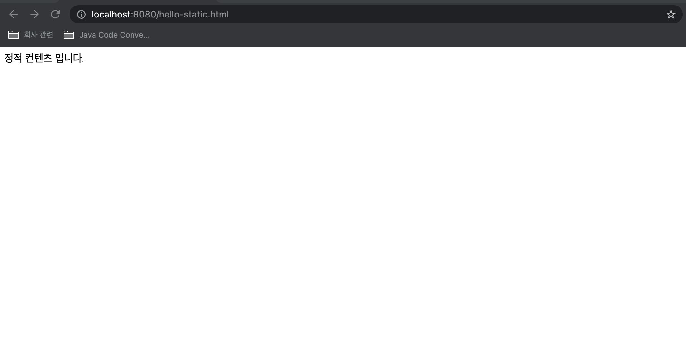
  

- 동작 환경
  - 먼저 *Controller*가 있는지 확인
  - *Controller*에 없으면 `resources`에 있는지 확인
  - `resources`에 있으면 출력  

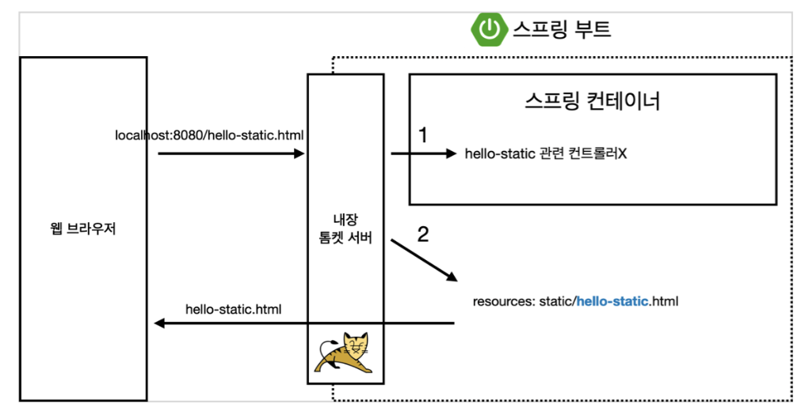
  

- 관련 문서
  - [스프링 부트 매뉴얼](https://docs.spring.io/spring-boot/docs/current/reference/htmlsingle/#web.servlet.spring-mvc.static-content)
  

### MVC와 Template 엔진
- 동작 확인
  - `src/main/java/hello.hellospring/controller/HelloController.java`에 `helloMvc` 메서드 추가
  - `resources/template/hello-template.html` 생성
  - `src/main/java/hello.hellospring/HelloSpringApplication.java`의 `main` 메서드 실행
  - `http://localhost:8080/hello-mvc?name=spring` 호출 시 아래와 같은 화면 출력  


  

- 동작 환경
  - `http://localhost:8080/hello-mvc?name=spring`  

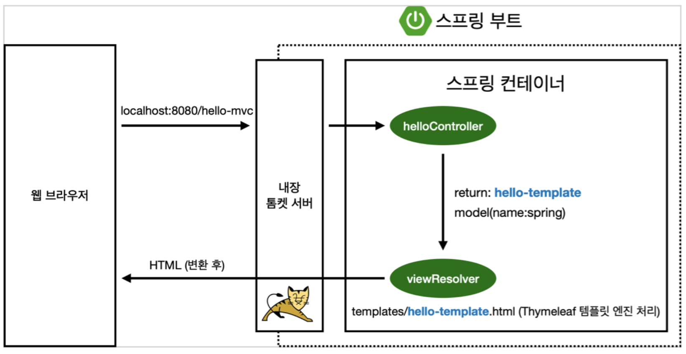
  

### API
- 동작 확인
  - `@ResponseBody` 문자 반환
    - `src/main/java/hello.hellospring/controller/HelloController.java`에 `helloString` 메서드 추가
    - `src/main/java/hello.hellospring/HelloSpringApplication.java`의 `main` 메서드 실행
    - `http://localhost:8080/hello-string?name=spring` 호출 시 아래와 같은 화면 출력  

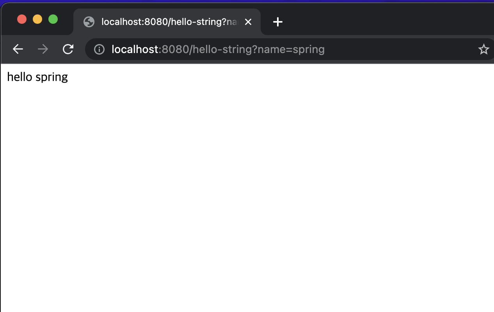
  

  - `@ResponseBody` 객체 반환
    - `src/main/java/hello.hellospring/controller/HelloController.java`에 `helloApi` 메서드 추가
    - `src/main/java/hello.hellospring/HelloSpringApplication.java`의 `main` 메서드 실행
    - `http://localhost:8080/hello-api?name=spring` 호출 시 아래와 같은 화면 출력  

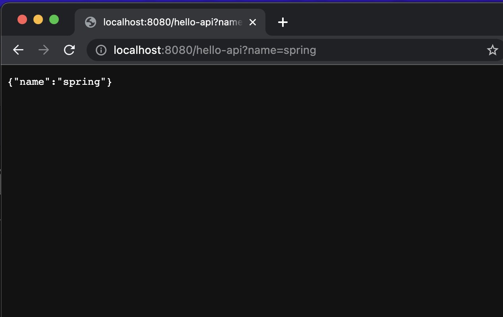
  
  
- 동작 환경
  - `@ResponseBody`를 사용하면 *viewResolver* 대신에 *HttpMessageConverter*가 동작
    - 문자 처리: *StringHttpMessageConverter*
    - 객체 처리: *MappingJackson2HttpMessageConverter*
    - byte 처리 등 여러가지 *HttpMessageConverter*가 기본적으로 등록  

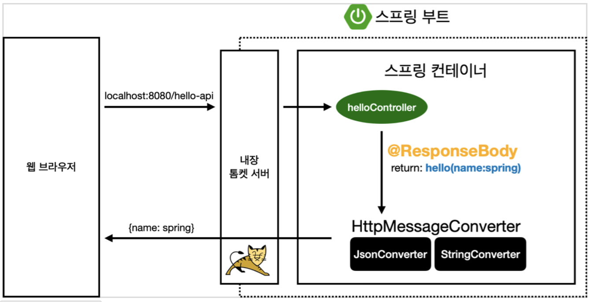
  

## 회원 관리 예제 - 백엔드 개발
- Controller: 웹 MVC의 Controller 역할
- Service: 핵심 비즈니스 로직 구현
- Repository: 데이터베이스에 접근, Domain 객체를 DB에 저장하고 관리
- Domain: 비즈니스 Domain 객체, 주로 데이터베이스에 저장하고 관리  

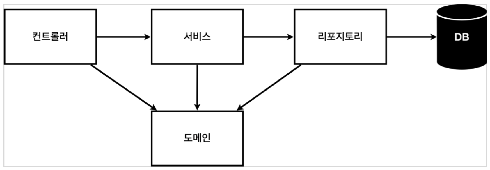

### 비즈니스 요구사항 정리
- 데이터: 회원ID, 이름
- 기능: 회원 등록, 조회
- 비고: 아직 데이터 저장소가 선정되지 않아 우선 인터페이스로 구현 클래스를 변경할 수 있도록 설계
  - 데이터 저장소는 RDB, NoSQL 등 다양한 저장소를 고민 중인 상황
  - 개발을 진행하기 위해서 초기 개발 단계에서는 구현체로 가벼운 메모리 기반의 데이터 저장소 사용  

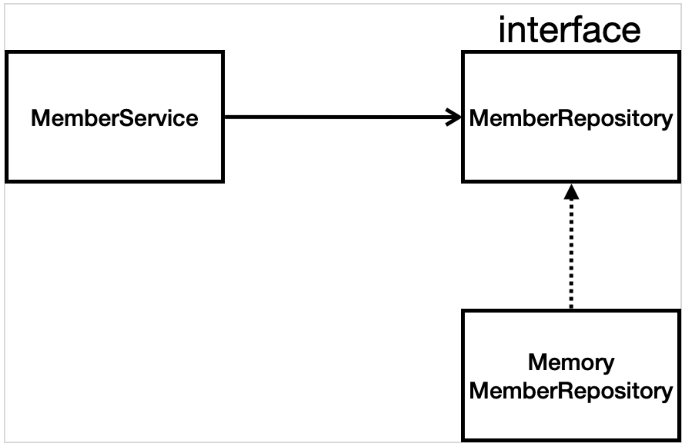

### 회원 Domain과 Repository 만들기
  

#### 회원 객체
- `src/main/java/hello.hellospring/domain/Member.java` 생성
  

#### 회원 Repository 인터페이스
- `src/main/java/hello.hellospring/repository/MemberRepository.java` 생성
  

#### 회원 Repository 메모리 구현체
- `src/main/java/hello.hellospring/repository/MemoryMemberRepository.java` 생성
  

### 회원 Repository 테스트 케이스 작성
- 개발한 기능을 실행해서 테스트할 때 Java의 main 메서드를 통해서 실행하거나, 웹 어플리케이션의 Controller를 통해서 해당 기능을 실행한다.  
  - 이러한 방법은 준비하고 실행하는데 오래 걸리고, 반복 실행하기 어렵고 여러 테스트를 한 번에 실행하기 어렵다는 단점이 있다.  
  - Java는 JUnit이라는 프레임워크로 테스트를 실행해서 이러한 문제를 해결한다.
- 테스트는 각각 독립적으로 실행되어야 한다.  
  - 테스트 순서에 의존 관계가 있는 것은 좋은 테스트가 아니다.
  

#### 회원 Repository 메모리 구현체 테스트
- `src/test/java/hello.hellospring/repository/MemoryMemberRepositoryTest.java` 생성
  - 한 번에 여러 테스트를 실행하면 메모리 DB에 직전 테스트의 결과가 남을 수 있다.  
  - 이렇게 되면 다음 이전 테스트 때문에 다음 테스트가 실패할 가능성이 있다.  
  - `@AfterEach`를 사용하면 각 테스트가 종료될 때마다 이 기능을 실행한다.
  - 여기서는 메모리 DB에 저장된 데이터를 삭제한다.
  

### 회원 Service 개발
- `src/main/java/hello.hellospring/service/MemberService.java` 생성
  

### 회원 Service 테스트
- `src/test/java/hello.hellospring/service/MemberServiceTest.java` 생성
  - 기존에는 회원 Service가 메모리 회원 Repository를 직접 생성하게 했다.
  - 회원 Repository의 코드가 회원 Service 코드를 DI 가능하게 변경한다.
  - `@BeforeEach`를 사용하면 각 테스트 실행 전에 호출된다.
  - 테스트가 서로 영향이 없도록 항상 새로운 객체를 생성하고, 의존 관계도 새로 맺어준다.
  

## Spring Bean과 의존 관계
  

### Component Scan과 자동 의존 관계 설정
  

#### 회원 Controller에 의존 관계 추가
- `src/main/java/hello.hellospring/controller/MemberController.java`에 Class 선언문 바로 위에 `@Controller` 어노테이션 추가
- 생성자에 `@Autowired`가 있으면 Spring이 연관된 객체를 Spring Container에서 찾아서 넣어준다.
- 이렇게 객체 의존 관계를 외부에서 넣어주는 것을 DI(Dependency Injection, 의존성 주입)라 한다.
  

#### Component Scan 원리
- `@Component` 어노테이션이 있으면 Spring Bean이 자동 등록된다.
- `@Controller`가 있으면 Spring Bean이 자동 등록되는데, 그 이유는 *Component Scan* 때문이다. 
- `@Component`를 포함하는 다음 어노테이션도 Spring Bean으로 자동 등록된다.
  - `@Controller`
  - `@Service`
  - `@Repository`
  

#### 회원 Service Spring Bean 등록
- `src/main/java/hello.hellospring/service/MemberService.java`에 Class 선언문 바로 위에 `@Service` 어노테이션 추가
- 생성자에 `@Autowired`를 사용하면 객체 생성 시점에 Spring Container에서 해당 Spring Bean을 찾아서 주입한다.
- 생성자가 1개만 있으면 `@Autowired`는 생략할 수 있다.
  

#### 회원 Repository Spring Bean 등록
- `src/main/java/hello.hellospring/repository/MemoryMemberRepository.java`에 Class 선언문 바로 위에 `@Repository` 어노테이션 추가
  

#### Spring Bean 등록
- Spring은 Spring Container에 Spring Bean을 등록할 때, 기본으로 Singleton으로 등록한다.
  - 유일하게 하나만 등록해서 공유한다.
- 따라서 같은 Spring Bean이면 모두 같은 인스턴스다.
- 설정으로 Singleton이 아니게 설정할 수 있지만, 특수한 경우를 제외하면 대부분 Singleton을 사용한다.  

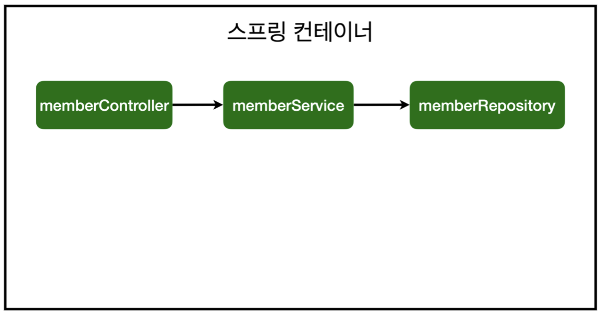
  

## Java Code로 직접 Spring Bean 등록하기
- 향후 Memory Repository를 다른 Repository로 변경할 예정이므로, Component Scan 방식 대신에 Java Code로 Spring Bean을 설정한다.
  - 회원 Service와 회원 Repository의 `@Service`, `@Repository`, `@Autowired` 어노테이션을 제거
- XML로 설정하는 방식도 있지만 최근에는 잘 사용하지 않음
- DI는 Field 주입, Setter 주입, 생성자 주입 3가지 방식이 있다.
  - Runtime 중에 의존 관계가 동적으로 변하는 경우가 아예 없으므로 *생성자 주입* 방식을 권장
- 실무에서는 주로 정형화된 Controller, Service, Repository와 같은 코드는 Component Scan을 사용
  - 정형화 되지 않거나, 상황에 따라 구현 클래스를 변경해야 하면 설정을 통해 Spring Bean으로 등록
- `@Autowired`를 통한 DI는 Spring이 관리하는 객체에서만 동작한다.
  - Spring Bean으로 등록하지 않고 직접 생성한 객체에서는 동작하지 않는다.
  

## 회원 관리 예제 - 웹 MVC 개발


### 회원 웹 기능 - 홈 화면 추가


#### 홈 Controller 추가
- `src/main/java/hello.hellospring/controller/HomeController.java` 생성
  - Controller가 Static 파일보다 우선 순위가 높다.
    - "/" 도메인 주소가 Controller에 없으면 Static 파일이 출력
    - "/" 도메인 주소가 Controller에 있으면 Controller에서 지정한 HTML 파일이 출력
- `src/main/resources/templates/home.html` 생성


### 회원 웹 기능 - 등록


#### 회원 등록 Form 생성
- `src/main/java/hello.hellospring/controller/MemberController.java`에 `createForm` 메서드 추가
- `src/main/resources/templates/members/createMemberForm.html` 생성


#### 웹 등록 화면에서 데이터를 전달 받을 Form 객체
- `src/main/java/hello.hellospring/controller/MemberForm.java` 생성


#### 회원 Controller에서 회원을 실제로 등록하는 기능
- `src/main/java/hello.hellospring/controller/MemberController.java`에 `create` 메서드 추가


### 회원 웹 기능 - 조회


#### 회원 Controller에서 조회 기능
- `src/main/java/hello.hellospring/controller/MemberController.java`에 `list` 메서드 추가
- `src/main/resources/templates/members/memberList.html` 생성


## 스프링 DB 접근 기술


### H2 데이터베이스 설치
- [www.h2database.com](https://www.h2database.com)에서 다운로드
  - Download > Archive Downloads > 1.4.200 > Platform-Independent Zip
- 다운로드 파일 압축 해제
- 압축 해제한 폴더로 접근
- `cd bin`
- `chmod 755 h2.sh` 명령어로 파일 권한 변경
- `./h2.sh`로 실행
- 웹 브라우저에서 H2 콘솔 표시
- 데이터베이스 파일 생성
  - `jdbc:h2:~/test`로 최초로 실행
  - `~/test.mv.db` 파일 생성 여부 확인
  - 이제부터 `jdbc:h2:tcp://localhost/~/test`로 접속


### 테이블 생성하기
```
drop table if exists member CASCADE;
create table member
(
  id    bigint  generated by default as identity,
  name  varchar(255),
  primary key (id)
);
```


### 생성한 테이블에 데이터 추가하기
```
insert into member(name) values('spring');
```


### 추가한 데이터 조회하가
```
select * from member;
```


# 출처
- [[인프런] 스프링 입문 - 코드로 배우는 스프링 부트, 웹 MVC, DB 접근 기술
 (5.0)](https://www.inflearn.com/course/%EC%8A%A4%ED%94%84%EB%A7%81-%EC%9E%85%EB%AC%B8-%EC%8A%A4%ED%94%84%EB%A7%81%EB%B6%80%ED%8A%B8)
