# 스프링 핵심 원리 - 기본편


## 목차

1. 객체 지향 설계와 스프링

2. 스프링 핵심 원리 이해 1 - 예제 만들기

3. 스프링 핵심 원리 이해 2 - 객체 지향 원리 적용

4. 스프링 컨테이너와 스프링 빈

5. 싱글톤 컨테이너

6. 컴포넌트 스캔

7. 의존 관계 자동 주입

8. 빈 생명 주기 콜백

9. 빈 스코프

10. 다음으로


## 1. 객체 지향 설계와 스프링


### 목차

[1] 이야기 - 자바 진영의 추운 겨울과 스프링의 탄생

[2] 스프링이란?

[3] 좋은 객체 지향 프로그래밍이란?

[4] 좋은 객체 지향 설계의 5가지 원칙(SOLID)

[5] 객체 지향 설계와 스프링


## 2. 스프링 핵심 원리 이해 1 - 예제 만들기


### 목차

[1] 프로젝트 생성

[2] 비즈니스 요구사항과 설계

[3] 회원 도메인 설계

[4] 회원 도메인 개발

[5] 회원 도메인 실행과 테스트

[6] 주문과 할인 도메인 설계

[7] 주문과 할인 도메인 개발

[8] 주문과 할인 도메인 실행과 테스트


### [1] 프로젝트 생성


#### 사전 준비물
- Java 11
- IDE: IntelliJ or Eclipse
  

#### Spring Boot Starter에서 Spring 프로젝트 생성
- [start.spring.io](https://start.spring.io/)
  - 프로젝트 설정
    - Project: Gradle - Groovy Project
    - Language: Java
    - Spring Boot: 2.7.9
    - Project Metadata
      - group: com.k1m743hyun
      - Artifact: core-spring
      - Packaging: Jar
      - Java: 11
    - Dependencies: 선택하지 않음
  - 설정 완료 후 Generate 클릭
  - zip 파일 다운로드 완료 후 압축 해제
  - IntelliJ 실행 후 압축 해제한 디렉토리 열기


#### 동작 확인
- 기본 메인 클래스(`CoreSpringApplication.main()`) 실행


#### IntelliJ Gradle 대신에 Java 직접 실행
- 최근 IntelliJ 버전은 Gradle을 통해서 실행하는 것이 기본 설정
- 이렇게 설정되어 있으면 실행 속도가 느림
- 다음과 같이 변경하면 Java로 바로 실행해서 실행 속도가 더 빠름
    - Preferences -> Build, Execution, Deployment -> Build Tools -> Gradle
        - Build and run using: Gradle -> IntelliJ IDEA
        - Run tests using: Gradle -> IntelliJ IDEA


### [2] 비즈니스 요구사항과 설계
- 회원
  - 회원을 가입하고 조회할 수 있음
  - 회원은 일반과 VIP 두 가지 등급이 있음
  - 회원 데이터는 자체 DB를 구축하거나 외부 시스템과 연동할 수 있음 (미확정)

- 주문과 할인 정책
  - 회원은 상품을 주문할 수 있음
  - 회원 등급에 따라 할인 정책을 적용할 수 있음
  - 할인 정책은 모든 VIP에게 1000원을 할인해주는 고정 금액 할인을 적용해달라 (나중에 변경될 수 있음)
  - 할인 정책은 변경 가능성이 높음
    - 회사의 기본 할인 정책을 아직 정하지 못 했음
    - 오픈 직전까지 고민을 미루고 싶음
    - 최악의 경우 할인을 적용하지 않을 수도 있음 (미확정)

- 요구사항을 보면 회원 데이터, 할인 정책 같은 부분은 지금 결정하기 어려운 부분이 있음
- 그렇다고 이런 정책이 결정될 때까지 개발을 무기한 미룰 수 없음
- 객체 지향 설계 방법을 사용하여 인터페이스를 만들고 구현체를 언제든지 갈아끼울 수 있도록 설계해보자


### [3] 회원 도메인 설계
- 회원 도메인 요구사항
  - 회원을 가입하고 조회할 수 있음
  - 회원은 일반과 VIP 두 가지 등급이 있음
  - 회원 데이터는 자체 DB를 구축하거나 외부 시스템과 연동할 수 있음 (미확정)


#### 회원 도메인 협력 관계


#### 회원 클래스 다이어그램
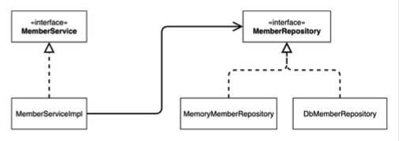


#### 회원 객체 다이어그램


### [4] 회원 도메인 개발


#### 회원 엔티티


##### 회원 등급
- [Grade.java](https://github.com/k1m743hyun/spring-exercise/blob/main/core-spring/src/main/java/com/k1m743hyun/corespring/member/Grade.java)


##### 회원 엔티티
- [Member.java](https://github.com/k1m743hyun/spring-exercise/blob/main/core-spring/src/main/java/com/k1m743hyun/corespring/member/Member.java)


#### 회원 저장소


##### 회원 저장소 인터페이스
- [MemberRepository.java](https://github.com/k1m743hyun/spring-exercise/blob/main/core-spring/src/main/java/com/k1m743hyun/corespring/member/MemberRepository.java)


##### 메모리 회원 저장소 구현체
- [MemoryMemberRepository.java](https://github.com/k1m743hyun/spring-exercise/blob/main/core-spring/src/main/java/com/k1m743hyun/corespring/member/MemoryMemberRepository.java)


- 데이터베이스가 아직 확정이 안되었음
  - 그래도 개발은 진행해야하니 가장 단순한 메모리 회원 저장소를 구현해서 우선 개발을 진행하자
- 참고) `HashMap`은 동시성 이슈가 발생할 수 있음
  - 이런 경우 `ConcurrentHashMap`을 사용하자


#### 회원 서비스


##### 회원 서비스 인터페이스
- [MemberService.java](https://github.com/k1m743hyun/spring-exercise/blob/main/core-spring/src/main/java/com/k1m743hyun/corespring/member/MemberService.java)


##### 회원 서비스 구현체
- [MemberServiceImpl.java](https://github.com/k1m743hyun/spring-exercise/blob/main/core-spring/src/main/java/com/k1m743hyun/corespring/member/MemberServiceImpl.java)


### [5] 회원 도메인 실행과 테스트


#### 회원 도메인 - 회원 가입 main
- [MemberApp.java]](https://github.com/k1m743hyun/spring-exercise/blob/main/core-spring/src/main/java/com/k1m743hyun/corespring/MemberApp.java)
- 애플리케이션 로직으로 이렇게 테스트 하는 것은 좋은 방법이 아님
  - JUnit 테스트를 사용하자


#### 회원 도메인 - 회원 가입 테스트
- [CoreSpringApplicationTests.java ](https://github.com/k1m743hyun/spring-exercise/blob/main/core-spring/src/test/java/com/k1m743hyun/corespring/CoreSpringApplicationTests.java)


#### 회원 도메인 설계의 문제점
- 이 코드의 설계 상 문제점은 무엇일까?
  - 다른 저장소로 변경할 때 OCP 원칙을 잘 준수하는가?
  - DIP를 잘 지키고 있는가?
  - 의존 관계가 인터페이스 뿐만 아니라 구현까지 모두 의존하는 문제점이 있음


### [6] 주문과 할인 도메인 설계
- 주문과 할인 정책
  - 회원은 상품을 주문할 수 있음
  - 회원 등급에 따라 할인 정책을 적용할 수 있음
  - 할인 정책은 모든 VIP에게 1000원을 할인해주는 고정 금액 할인을 적용해달라 (나중에 변경될 수 있음)
  - 할인 정책은 변경 가능성이 높음
    - 회사의 기본 할인 정책을 아직 정하지 못 했음
    - 오픈 직전까지 고민을 미루고 싶음
    - 최악의 경우 할인을 적용하지 않을 수도 있음 (미확정)


#### 주문 도메인 협력, 역할, 책임
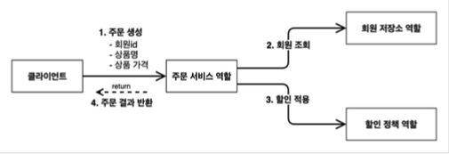
- (1) 주문 생성
  - 클라이언트는 주문 서비스에 주문 생성을 요청
- (2) 회원 조회
  - 할인을 위해서는 회원 등급이 필요
  - 그래서 주문 서비스는 회원 저장소에서 회원을 조회함
- (3) 할인 적용
  - 주문 서비스는 회원 등급에 따른 할인 여부를 할인 정책에 위임함
- (4) 주문 결과 반환
  - 주문 서비스는 할인 결과를 포함한 주문 결과를 반환함
- 참고) 실제로는 주문 데이터를 DB에 저장하겠지만, 예제가 너무 복잡해질 수 있어서 생략하고, 단순히 주문 결과를 반환함


#### 주문 도메인 전체

- *역할과 구현을 분리*해서 자유롭게 구현 객체를 조립할 수 있게 설계
  - 덕분에 회원 저장소는 물론이고, 할인 정책도 유연하게 변경할 수 있음


#### 주문 도메인 클래스 다이어그램
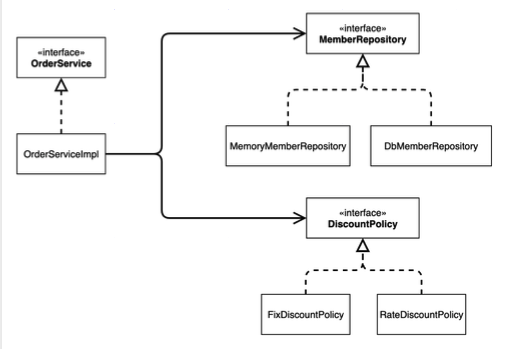


#### 주문 도메인 객체 다이어그램 1
.png)
- 회원을 메모리에서 조회하고, 정액 할인 정책(고정 금액)을 지원해도 주문 서비스를 변경하지 않아도 됨
- 역할들의 협력 관계를 그대로 재사용할 수 있음


#### 주문 도메인 객체 다이어그램 2
.png)
- 회원을 메모리가 아닌 실제 DB에서 조회하고, 정률 할인 정책(주문 금액에 따라 % 할인)을 지원해도 주문 서비스를 변경하지 않아도 됨
- 협력 관계를 그대로 재사용할 수 있음


### [7] 주문과 할인 도메인 개발


#### 할인 정책 인터페이스
- [DiscountPolicy.java](https://github.com/k1m743hyun/spring-exercise/blob/main/core-spring/src/main/java/com/k1m743hyun/corespring/discount/DiscountPolicy.java)


#### 정액 할인 정책 구현체
- [FixDiscountPolicy.java](https://github.com/k1m743hyun/spring-exercise/blob/main/core-spring/src/main/java/com/k1m743hyun/corespring/discount/FixDiscountPolicy.java)
- VIP면 1000원 할인, 아니면 할인 없음

#### 주문 엔티티
- [Order.java](https://github.com/k1m743hyun/spring-exercise/blob/main/core-spring/src/main/java/com/k1m743hyun/corespring/order/Order.java)


#### 주문 서비스 인터페이스
- [OrderService.java](https://github.com/k1m743hyun/spring-exercise/blob/main/core-spring/src/main/java/com/k1m743hyun/corespring/order/OrderService.java)


#### 주문 서비스 구현체
- [OrderServiceImpl.java](https://github.com/k1m743hyun/spring-exercise/blob/main/core-spring/src/main/java/com/k1m743hyun/corespring/order/OrderServiceImpl.java)
- 주문 생성 요청이 오면, 회원 정보를 조회하고, 할인 정책을 적용한 다음 주문 객체를 생성해서 반환함
- **메모리 회원 리포지토리와, 고정 금액 할인 정책을 구현체로 생성함**


### [8] 주문과 할인 도메인 실행과 테스트


#### 주문과 할인 정책 실행
- [OrderApp.java](https://github.com/k1m743hyun/spring-exercise/blob/main/core-spring/src/main/java/com/k1m743hyun/corespring/OrderApp.java)
- 애플리케이션 로직으로 이렇게 테스트하는 것은 좋은 방법은 아님
  - JUnit 테스트를 사용하자


#### 주문과 할인 정책 테스트
- [OrderServiceTest.java](https://github.com/k1m743hyun/spring-exercise/blob/main/core-spring/src/test/java/com/k1m743hyun/corespring/order/OrderServiceTest.java)


## 3. 스프링 핵심 원리 이해 2 - 객체 지향 원리 적용


### 목차

[1] 새로운 할인 정책 개발

[2] 새로운 할인 정책 적용과 문제점

[3] 관심사의 분리

[4] AppConfig 리팩터링

[5] 새로운 구조와 할인 정책 적용

[6] 전체 흐름 정리

[7] 좋은 객체 지향 설계의 5가지 원칙의 적용

[8] IoC, DI, 그리고 컨테이너

[9] 스프링으로 전환하기


### [1] 새로운 할인 정책 개발
- 새로운 할인 정책을 확장해보자
  - 주문한 금액의 %를 할인해주는 새로운 정률 할인 정책을 추가하자
- 참고) 애자일 소프트웨어 개발 선언
  - https://agilemanifesto.org/iso/ko/manifesto.html


#### RateDiscountPolicy 추가
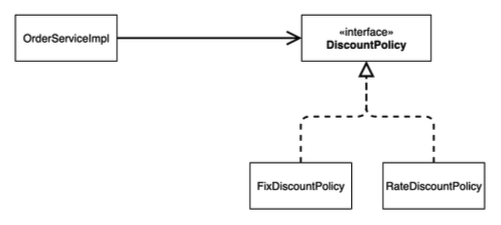


#### RateDiscountPolicy 코드 추가
- [RateDiscountPolicy.java](https://github.com/k1m743hyun/spring-exercise/blob/main/core-spring/src/main/java/com/k1m743hyun/corespring/discount/RateDiscountPolicy.java)


#### 테스트 작성
- [RateDiscountPolicyTest.java](https://github.com/k1m743hyun/spring-exercise/blob/main/core-spring/src/test/java/com/k1m743hyun/corespring/discount/RateDiscountPolicyTest.java)


### [2] 새로운 할인 정책 적용과 문제점
- 방금 추가한 할인 정책을 애플리케이션에 적용해보자
  - 할인 정책을 변경하려면 클라이언트인 `OrderServiceImpl` 코드를 고쳐야 함
  - [OrderServiceImpl.java](https://github.com/k1m743hyun/spring-exercise/blob/main/core-spring/src/main/java/com/k1m743hyun/corespring/order/OrderServiceImpl.java)

#### 문제점 발견
- 역할과 구현을 충실하게 분리함
- 다형성도 활용하고, 인터페이스와 구현 객체를 분리함
- OCP, DIP 같은 객체지향 설계 원칙을 충실히 준수함
  - 그렇게 보이지만 사실 아님
  - 주문 서비스 클라이언트(`OrderServiceImpl`)는 `DiscountPolicy` 인터페이스에 의존하면서 DIP를 지킨 것 같다?
    - 클래스 의존 관계를 분석해보면, 인터페이스 뿐만 아니라 **구현 클래스**에도 의존하고 있음
      - 인터페이스: `DiscountPolicy`
      - 구현 클래스: `FixDiscountPolicy`, `RateDiscountPolicy`
  - 변경하지 않고 확장할 수 있다고 했지만
    - *지금 코드에서는 기능을 확장해서 변경하면, 클라이언트 코드에 영향을 준다!*
    - 따라서 **OCP를 위반**한 것임


#### 왜 클라이언트 코드를 변경해야 할까?


##### 기대했던 의존 관계
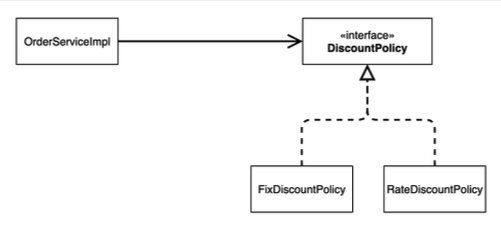
- `DiscountPolicy` 인터페이스만 의존한다고 생각했지만


##### 실제 의존 관계
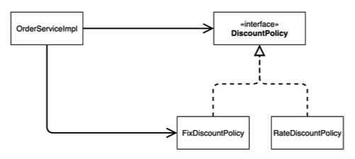
- 클라이언트인 `OrderServiceImpl`이 `DiscountPolicy` 인터페이스 뿐만 아니라 `FixDiscountPolicy`인 구현 클래스도 함께 의존하고 있음
- **DIP 위반**


##### 정책 변경
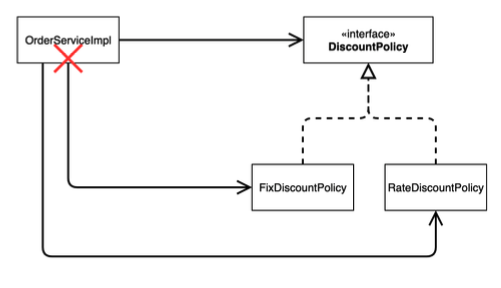
- 중요!) `FixDiscountPolicy`를 `RateDiscountPolicy`로 변경하는 순간 `OrderServiceImpl`의 소스 코드도 함께 변경해야 함
- **OCP 위반**


##### 어떻게 문제를 해결할 수 있을까?
- 클라이언트 코드인 `OrderServiceImpl`은 `DiscountPolicy`의 인터페이스 뿐만 아니라 구현 클래스도 함께 의존함
- 그래서 구현 클래스를 변경할 때 클라이언트 코드도 함께 변경해야 함
- **DIP 위반** => 인터페이스에만 의존하도록 변경
- DIP를 위반하지 않도록 인터페이스에만 의존하도록 의존 관계를 변경하면 됨


##### 인터페이스에만 의존하도록 설계를 변경하자


##### 인터페이스만 의존하도록 코드 변경
- [OrderServiceImpl.java](https://github.com/k1m743hyun/spring-exercise/blob/main/core-spring/src/main/java/com/k1m743hyun/corespring/order/OrderServiceImpl.java)
- 인터페이스에만 의존하도록 설계와 코드를 변경함
- *그런데 구현체가 없는데 어떻게 코드를 실행할 수 있을까?*
- 실제 실행을 해보면 NPE(Null Pointer Exception)가 발생함


##### 해결 방안
- 이 문제를 해결하려면 누군가가 클라이언트인 `OrderServiceImpl`에 `DiscountPolicy`의 구현 객체를 대신 생성하고 주입해주어야 함


### [3] 관심사의 분리
- 애플리케이션을 하나의 공연이라고 생각해보자
- 각각의 인터페이스를 배역(배우 역할)이라 생각하자
- 남자 주인공을 누가할 지, 여자 주인공을 누가할 지는 배우들이 선택하는 것이 아님
- 이전에 작성한 코드는 마치 남자 주인공으로 선택된 배우가 여자 주인공을 직접 선택하는 것과 같음
- 남자 주인공으로 선택된 배우는 남자 주인공 역할과 동시에 여자 주인공을 선택하는 역할을 가지므로 여러 책임으로 가지고 있음 


#### 관심사를 분리하자
- 배우는 본인의 역할인 배역을 수행하는 것에만 집중해야 함
  - 남자 주인공은 어떤 여자 주인공이 선택되더라도 똑같이 공연할 수 있어야 함
- 역할에 맞는 배우를 선택하는 책임을 갖는 별도의 *공연 기획자*가 나올 시점
- 수정할 코드에서는 공연 기획자를 생성하고, 배우와 공연 기획자의 책임을 확실히 분리하도록 하자


#### AppConfig 등장
- 애플리케이션의 전체 동작 방식을 구성(Config)하기 위해, *구현 객체를 생성*하고, *연결*하는 책임을 가지는 별도의 설정 클래스를 만들자


##### AppConfig
- [AppConfig.java](https://github.com/k1m743hyun/spring-exercise/tree/main/core-spring/src/main/java/com/k1m743hyun/corespring/AppConfig.java)
- AppConfig는 애플리케이션의 실제 동작에 필요한 *구현 객체를 생성*
  - `MemberServiceImpl`
  - `MemoryMemberRepository`
  - `OrderServiceImpl`
  - `FixDiscountPolicy`
- AppConfig는 생성한 객체 인스턴스의 참조(레퍼런스)를 생성자를 통해서 주입(연결)
  - `MemberServiceImpl` => `MemoryMemberRepository`
  - `OrderServiceImpl` => `MemoryMemberRepository`, `FixDiscountPolicy`


##### MemberServiceImpl - 생성자 주입
- [MemberServiceImpl.java](https://github.com/k1m743hyun/spring-exercise/blob/main/core-spring/src/main/java/com/k1m743hyun/corespring/member/MemberServiceImpl.java)
- 설계 변경으로 `MemberServiceImpl`은 `MemoryMemberRepository`를 의존하지 않음
- 단지 `MemberRepository` 인터페이스만 의존
- `MemberServiceImpl` 입장에서 생성자를 통해 어떤 구현 객체가 들어올 지(주입될 지)는 알 수 없음
- `MemberServiceImpl`의 생성자를 통해서 어떤 구현 객체를 주입할 지는 오직 외부(`AppConfig`)에서 결정됨
- `MemberServiceImpl`은 이제부터 *의존 관계에 대한 고민은 외부*에 맡기고 *실행에만 집중*하면 됨


##### 클래스 다이어그램
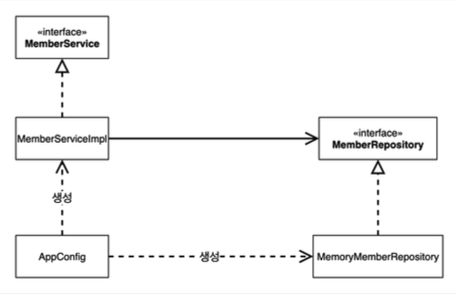
- 객체의 생성과 연결은 `AppConfig`가 담당
- DIP 완성
  - `MemberServiceImpl`은 `MemberRepository`인 인터페이스에만 의존하면 됨
  - 이제 구현 클래스를 몰라도 됨
- 관심사의 분리
  - 객체를 생성하고 연결하는 역할과 실행하는 역할이 명확히 분리됨


##### 회원 객체 인스턴스 다이어그램
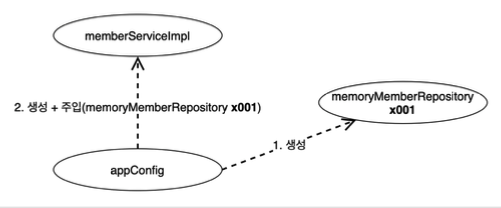
- `appConfig` 객체는 `memoryMemberRepository` 객체를 생성하고 그 참조값을 `memberServiceImpl`을 생성하면서 생성자로 전달함
- 클라이언트인 `memberServiceImpl` 입장에서 보면 의존 관계를 마치 외부에서 주입해주는 것 같다고 해서 DI(Dependency Injection) 우리말로 *의존 관계 주입* 또는 *의존성 주입*이라 함


##### OrderServiceImpl - 생성자 주입
- [OrderServiceImpl.java](https://github.com/k1m743hyun/spring-exercise/blob/main/core-spring/src/main/java/com/k1m743hyun/corespring/order/OrderServiceImpl.java)
- 설계 변경으로 `OrderServiceImpl`은 `FixDiscountPolicy`를 의존하지 않음
- 단지 `DiscountPolicy` 인터페이스만 의존함
- `OrderServiceImpl` 입장에서 생성자를 통해 어떤 구현 객체가 들어올 지(주입될 지)는 알 수 없음
- `OrderServiceImpl`의 생성자를 통해서 어떤 구현 객체를 주입할 지는 오직 외부(`AppConfig`)에서 결정함
- `OrderServiceImpl`은 이제부터 실행에만 집중하면 됨
- `OrderServiceImpl`에는 `MemoryMemberRepository`, `FixDiscountPolicy` 객체의 의존 관계가 주입됨


#### AppConfig 실행


##### MemberApp
- [MemberApp.java](https://github.com/k1m743hyun/spring-exercise/tree/main/core-spring/src/main/java/com/k1m743hyun/corespring/MemberApp.java)


##### OrderApp
- [OrderApp.java](https://github.com/k1m743hyun/spring-exercise/tree/main/core-spring/src/main/java/com/k1m743hyun/corespring/OrderApp.java)


##### 테스트 코드 오류 수정
- [MemberServiceTest.java](https://github.com/k1m743hyun/spring-exercise/blob/main/core-spring/src/test/java/com/k1m743hyun/corespring/member/MemberServiceTest.java)
- [OrderServiceTest.java](https://github.com/k1m743hyun/spring-exercise/blob/main/core-spring/src/test/java/com/k1m743hyun/corespring/order/OrderServiceTest.java)
- 테스트 코드에서 `@BeforeEach`는 각 테스트를 실행하기 전에 호출됨


##### 정리
- `AppConfig`를 통해서 관심사를 확실하게 분리함
- 배역, 배우를 생각해보자
- `AppConfig`는 공연 기획자
- `AppConfig`는 구현 클래스를 선택함
  - 배역에 맞는 담당 배우를 선택함
  - 애플리케이션이 어떻게 동작해야 할지 전체 구성을 책임짐
- 이제 각 배우들은 담당 기능을 실행하는 책임만 지면 됨
- `OrderServiceImpl`은 기능을 실행하는 책임만 지면 됨


### [4] AppConfig 리팩터링
- 위에서 작성된 `AppConfig`를 보면 **중복**이 있고, **역할**에 따른 **구현**이 잘 안보임


#### 기대하는 그림
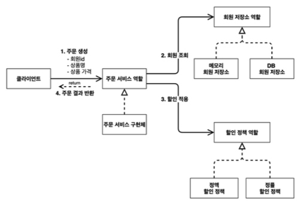


#### AppConfig 리팩터링
- 중복을 제거하고, 역할에 따른 구현이 보이도록 리팩터링 하자
- [AppConfig.java](https://github.com/k1m743hyun/spring-exercise/tree/main/core-spring/src/main/java/com/k1m743hyun/corespring/AppConfig.java)
- `new MemoryMemberRepository()` 이 부분이 중복 제거됨
- 이제 `MemoryMemberRepository`를 다른 구현체로 변경할 때 한 부분만 변경하면 됨
- `AppConfig`를 보면 역할과 구현 클래스가 한눈에 들어옴
- 애플리케이션 전체 구성이 어떻게 되어있는지 빠르게 파악할 수 있음


### [5] 새로운 구조와 할인 정책 적용
- 정액 할인 정책(`FixDiscountPolicy`)을 정률 할인 정책(`RateDiscountPolicy`)으로 변경해보자
- `AppConfig`의 등장으로 애플리케이션이 크게 사용 영역과, 객체를 생성하고 구성(Configuration)하는 영역으로 분리


#### 사용, 구성의 분리
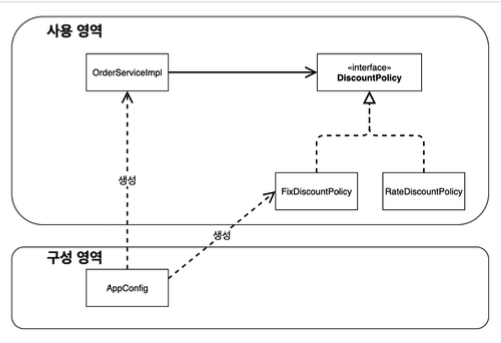


#### 할인 정책의 변경
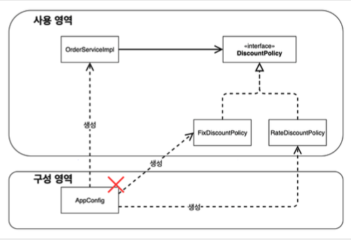
- `FixDiscountPolicy` => `RateDiscountPolicy`로 변경해도 구성 영역만 영향을 받고, 사용 영역은 전혀 영향을 받지 않음


#### 할인 정책 변경 구성 코드
- [AppConfig.java](https://github.com/k1m743hyun/spring-exercise/tree/main/core-spring/src/main/java/com/k1m743hyun/corespring/AppConfig.java)
- `AppConfig`에서 할인 정책 역할을 담당하는 구현을 `FixDiscountPolicy` => `RateDiscountPolicy` 객체로 변경함
- 이제 할인 정책을 변경해도, 애플리케이션의 구성 역할을 담당하는 `AppConfig`만 변경하면 됨
  - 클라이언트 코드인 `OrderServiceImpl`를 포함해서 **사용 영역**의 어떤 코드도 변경할 필요가 없음
- **구성 영역**은 당연히 변경이 됨
  - 구성 역할을 담당하는 `AppConfig`는 구현 객체들을 모두 알아야 함


### [6] 전체 흐름 정리
- 새로운 할인 정책 개발
- 새로운 할인 정책 적용과 문제점
- 관심사의 분리
- `AppConfig` 리팩터링
- 새로운 구조와 할인 정책 적용


#### 새로운 할인 정책 개발
- 다형성 덕분에 새로운 정률 할인 정책 코드를 추가로 개발하는 것 자체는 아무 문제가 없음


#### 새로운 할인 정책 적용과 문제점
- 새로 개발한 정률 할인 정책을 적용하려고 하니 **클라이언트 코드**인 주문 서비스 구현체도 함께 변경해야 함
- 주문 서비스 클라이언트가 인터페이스인 `DiscountPolicy` 뿐만 아니라, 구체 클래스인 `FixDiscountPolicy`도 함께 의존 => **DIP 위반**


#### 관심사의 분리
- 애플리케이션을 하나의 공연으로 생각
- 기존에는 클라이언트가 의존하는 서버 구현 객체를 직접 생성하고, 실행함
- 비유를 하면 기존에는 남자 주인공 배우가 공연도 하고, 동시에 여자 주인공도 직접 초빙하는 다양한 책임을 가지고 있음
- 공연을 구성하고, 담당 배우를 섭외하고, 지정하는 책임을 담당하는 별도의 **공연 기획자**가 나올 시점
- 공연 기획자인 `AppConfig`가 등장
- `AppConfig`는 애플리케이션의 전체 동작 방식을 구성(config)하기 위해, **구현 객체를 생성**하고, **연결**하는 책임
- 이제부터 클라이언트 객체는 자신의 역할을 실행하는 것만 집중
  - 권한이 줄어듬
  - 책임이 명확해짐


#### `AppConfig` 리팩터링
- 구성 정보에서 역할과 구현을 명확하게 분리
- 역할이 잘 드러남
- 중복 제거


#### 새로운 구조와 할인 정책 적용
- 정액 할인 정책 => 정률 할인 정책으로 변경
- `AppConfig`의 등장으로 애플리케이션이 크게 **사용 영역**과, 객체를 생성하고 **구성(Configuration)하는 영역**으로 분리
- 할인 정책을 변경해도 `AppConfig`가 있는 구성 영역만 변경하면 됨
  - 사용 영역은 변경할 필요가 없음
  - 물론 클라이언트 코드인 주문 서비스 코드도 변경하지 않음


### [7] 좋은 객체 지향 설계의 5가지 원칙 적용
- 위 예제에서 **SRP**, **DIP**, **OCP** 3가지 적용


#### SRP - 단일 책임 원칙
> 한 클래스는 하나의 책임만 가져야 함
- 클라이언트 객체는 직접 구현 객체를 생성하고, 연결하고, 실행하는 다양한 책임을 가지고 있음
- SRP 단일 책임 원칙을 따르면서 관심사를 분리함
- 구현 객체를 생성하고 연결하는 책임은 `AppConfig`가 담당
- 클라이언트 객체는 실행하는 책임만 담당


#### DIP - 의존 관계 역전 원칙
> 프로그래머는 "추상화에 의존해야지, 구체화에 의존하면 안됨"<br>
> 의존성 주입은 이 원칙을 따르는 방법 중 하나
- 새로운 할인 정책을 개발하고, 적용하려고 하니 클라이언트 코드도 함께 변경해야 했음
  - 왜냐하면 기존 클라이언트 코드(`OrderServiceImpl`)는 DIP를 지키며 `DiscountPolicy` 추상화 인터페이스에 의존하는 것 같았지만, `FixDiscountPolicy` 구체화 구현 클래스에도 함께 의존했음
- 클라이언트 코드가 `DiscountPolicy` 추상화 인터페이스에만 의존하도록 코드를 변경함
- 하지만 클라이언트 코드는 인터페이스만으로는 아무것도 실행할 수 없음
- `AppConfig`가 `FixDiscountPolicy` 객체 인스턴스를 클라이언트 코드 대신 생성해서 클라이언트 코드에 의존 관계를 주입했음
- 이렇게 해서 DIP 원칙을 따르면서 문제도 해결했음


#### OCP - 개방 폐쇄 원칙
> 소프트웨어 요소는 확장에는 열려 있으나 변경에는 닫혀 있어야 함
- 다형성 사용하고 클라이언트가 DIP를 지킴
- 애플리케이션을 사용 영역과 구성 영역으로 나눔
- `AppConfig`가 의존 관계를 `FixDiscountPolicy` => `RateDiscountPolicy`로 변경해서 클라이언트 코드에 주입하므로 클라이언트 코드는 변경하지 않아도 됨
- **"소프트웨어 요소를 새롭게 확장해도 사용 영역의 변경은 닫혀 있음"**


### [8] IoC, DI, 그리고 컨테이너


#### IoC(Inversion of Control) - 제어의 역전
- 기존 프로그램은 클라이언트 구현 객체가 스스로 필요한 서버 구현 객체를 생성하고, 연결하고, 실행했음
  - 한마디로 구현 객체가 프로그램의 제어 흐름을 스스로 조종했음
  - 개발자 입장에서는 자연스러운 흐름임
- 반면에 `AppConfig`가 등장한 이후에 구현 객체는 자신의 로직을 실행하는 역할만 담당함
  - 프로그램의 제어 흐름은 이제 `AppConfig`가 가져감
  - 예를 들어서 `OrderServiceImpl`은 필요한 인터페이스들을 호출하지만 어떤 구현 객체들이 실행될 지 모름
- 프로그램에 대한 제어 흐름에 대한 권한은 모두 `AppConfig`가 가지고 있음
  - 심지어 `OrderServiceImpl`도 `AppConfig`가 생성함
  - 그리고 `AppConfig`는 `OrderServiceImpl`이 아닌 `OrderService` 인터페이스의 다른 구현 객체를 생성하고 실행할 수도 있음
  - 그런 사실도 모른체 `OrderServiceImpl`은 묵묵히 자신의 로직을 실행할 뿐임
- 이렇듯 프로그램의 제어 흐름을 직접 제어하는 것이 아니라 외부에서 관리하는 것을 제어의 역전(IoC)이라 함


#### 프레임워크 VS 라이브러리
- 프레임워크가 내가 작성한 코드를 제어하고, 대신 실행하면 그것은 프레임워크가 맞음 (JUnit)
- 반면에 내가 작성한 코드가 직접 제어의 흐름을 담당한다면 그것은 프레임워크가 아니라 라이브러리임


#### DI(Dependency Injection) - 의존 관계 주입
- `OrderServiceImpl`은 `DiscountPolicy` 인터페이스에 의존함
  - 실제 어떤 구현 객체가 사용될 지는 모름
- 의존 관계는 정적인 클래스 의존 관계와, 실행 시점에 결졍되는 동적인 객체(인스턴스) 의존 관계 둘을 분리해서 생각해야 함


#### 정적인 클래스 의존 관계
- 클래스가 사용하는 import 코드만 보고 의존 관계를 쉽게 판단할 수 있음
- 정적인 의존 관계는 애플리케이션을 실행하지 않아도 분석할 수 있음
  - 클래스 다이어그램을 보면 `OrderServiceImpl`은 `MemberRepository`, `DiscountPolicy`에 의존한다는 것을 알 수 있음
- 그런데 이러한 클래스 의존 관계만으로는 실제 어떤 객체가 `OrderServiceImpl`에 주입될 지 알 수 없음


#### 클래스 다이어그램


#### 동적인 객체 인스턴스 의존 관계
- 애플리케이션 실행 시점에 실제 생성된 객체 인스턴스의 참조가 연결된 의존 관계임


#### 객체 다이어그램
.png)
- 애플리케이션 **실행 시점(런타임)**에 외부에서 실제 구현 객체를 생성하고 클라이언트에 전달해서 클라이언트와 서버의 실제 의존 관계가 연결되는 것을 **의존 관계 주입**이라 함
- 객체 인스턴스를 생성하고, 그 참조 값을 전달해서 연결됨
- 의존 관계 주입을 사용하면 클라이언트 코드를 변경하지 않고, 클라이언트가 호출하는 대상의 타입 인스턴스를 변경할 수 있음
- 의존 관계 주입을 사용하면 정적인 클래스 의존 관계를 변경하지 않고, 동적인 객체 인스턴스 의존 관계를 쉽게 변경할 수 있음


#### IoC 컨테이너, DI 컨테이너
- `AppConfig`처럼 객체를 생성하고 관리하면서 의존 관계를 연결해주는 것을 *IoC 컨테이너* 또는 *DI 컨테이너*라 함
- 의존 관계 주입에 초점을 맞추어 최근에는 주로 DI 컨테이너라 함
- 또는 어셈블러, 오브젝트 팩토리 등으로 불리기도 함


### [9] 스프링으로 전환하기
- 위 예제는 순수한 Java 코드만으로 DI를 적용함
- 이제 스프링을 사용해보자

#### AppConfig 스프링 기반으로 변경
- [AppConfig.java](https://github.com/k1m743hyun/spring-exercise/tree/main/core-spring/src/main/java/com/k1m743hyun/corespring/AppConfig.java)
- `AppConfig`에 설정을 구성한다는 뜻의 `@Configuration`을 붙여줌
- 각 메서드에 `@Bean`을 붙여줌으로 스프링 컨테이너에 스프링 빈으로 등록함


#### MemberApp에 스프링 컨테이너 적용
- [MemberApp.java](https://github.com/k1m743hyun/spring-exercise/tree/main/core-spring/src/main/java/com/k1m743hyun/corespring/MemberApp.java)
- 스프링 관련 로그가 몇 줄 실행되면서 기존과 동일한 결과가 출력됨


#### OrderApp에 스프링 컨테이너 적용
- [OrderApp.java](https://github.com/k1m743hyun/spring-exercise/tree/main/core-spring/src/main/java/com/k1m743hyun/corespring/OrderApp.java)
- 스프링 관련 로그가 몇 줄 실행되면서 기존과 동일한 결과가 출력됨


#### 스프링 컨테이너
- `ApplicationContext`를 스프링 컨테이너라 함
- 기존에는 개발자가 `AppConfig`를 사용해서 직접 객체를 생성하고 DI를 했지만, 이제부터는 스프링 컨테이너를 통해서 사용함
- 스프링 컨테이너는 `@Configuration`이 붙은 `AppConfig`를 설정(구성) 정보로 사용함
  - 여기서 `@Bean`이라 적힌 메서드를 모두 호출해서 반환된 객체를 스프링 컨테이너에 등록함
  - 이렇게 스프링 컨테이너에 등록된 객체를 *스프링 빈*이라 함
- 스프링 빈은 `@Bean`이 붙은 메서드 명을 스프링 빈의 이름으로 사용함 (`memeberService`, `orderService`)
- 이전에는 개발자가 필요한 객체를 `AppConfig`를 사용해서 직접 조회했지만, 이제부터는 스프링 컨테이너를 통해서 필요한 스프링 빈(객체)를 찾아야 함
  - 스프링 빈은 `applicationContext.getBean()` 메서드를 사용해서 찾을 수 있음
- 기존에는 개발자가 직접 자바 코드로 모든 것을 했다면 이제부터는 스프링 컨테이너에 객체를 스프링 빈으로 등록하고, 스프링 컨테이너에서 스프링 빈을 찾아서 사용하도록 변경되었음


## 4. 스프링 컨테이너와 스프링 빈


### 목차

[1] 스프링 컨테이너 생성

[2] 컨테이너에 등록된 모든 빈 조회

[3] 스프링 빈 조회 - 기본

[4] 스프링 빈 조회 - 동일한 타입이 둘 이상

[5] 스프링 빈 조회 - 상속 관계

[6] BeanFactory와 ApplicationContext

[7] 다양한 설정 형식 지원 - Java 코드, XML

[8] 스프링 빈 설정 메타 정보 - BeanDefinition


### [1] 스프링 컨테이너 생성
- 스프링 컨테이너가 생성되는 과정을 알아보자
```
ApplicationContext applicationContext = new AnnotationConfigApplicationContext(AppConfig.class);
```
- `ApplicationContext`를 스프링 컨테이너라 함
- `ApplicationContext`는 인터페이스임
- 스프링 컨테이너는 XML을 기반으로 만들 수 있고, 애노테이션 기반의 자바 설정 클래스로 만들 수 있음
- 직전에 `AppConfig`를 사용했던 방식이 애노테이션 기반의 Java 설정 클래스로 스프링 컨테이너를 만든 것임
- Java 설정 클래스를 기반으로 스프링 컨테이너(`ApplicationContext`)를 만들어보자
  - `new AnnotationConfigApplicationContext(AppConfig.class);`
  - 이 클래스는 `ApplicationContext` 인터페이스의 구현체임
- 참고) 더 정확히는 스프링 컨테이너를 부를 때 `BeanFactory`, `ApplicationContext`로 구분해서 이야기함
  - `BeanFactory`를 직접 사용하는 경우는 거의 없으므로 일반적으로 `ApplicationContext`를 스프링 컨테이너라 함


#### 스프링 컨테이너의 생성 과정


##### (1) 스프링 컨테이너 생성
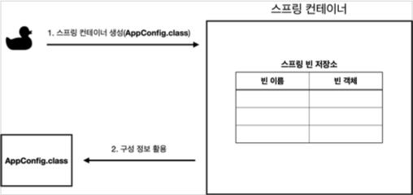
- `new AnnotationConfigApplicationContext(AppConfig.class)`
- 스프링 컨테이너를 생성할 때는 구성 정보를 지정해주어야 함
- 여기서는 `AppConfig.class`를 구성 정보로 지정함


##### (2) 스프링 빈 등록
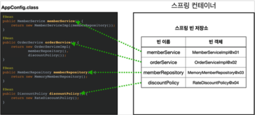
- 스프링 컨테이너는 파라미터로 넘어온 설정 클래스 정보를 사용해서 스프링 빈을 등록함

##### 빈 이름
- 빈 이름은 메서드 이름을 사용함
- 빈 이름을 직접 부여할 수도 있음
  - `@Bean(name="memberService2")`
- 주의) **빈 이름은 항상 다른 이름을 부여**해야 함
  - 같은 이름을 부여하면, 다른 빈이 무시되거나, 기존 빈을 덮어버리거나 설정에 따라 오류가 발생함


##### (3) 스프링 빈 의존 관계 설정 - 준비
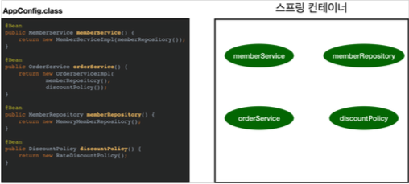


##### (4) 스프링 빈 의존 관계 설정 - 완료
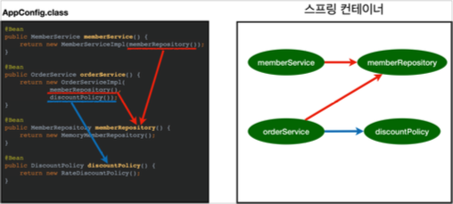
- 스프링 컨테이너는 설정 정보를 참고해서 의존 관계를 주입(DI)함
- 단순히 Java 코드를 호출하는 것 같지만, 차이가 있음


##### 참고
- 스프링은 빈을 생성하고, 의존 관계를 주입하는 단계가 나뉘어져 있음
  - 그런데 Java 코드로 스프링 빈을 등록하면 생성자를 호출하면서 의존 관계 주입도 한번에 처리됨


##### 정리
- 스프링 컨테이너를 생성하고, 설정(구성) 정보를 참고해서 스프링 빈도 등록하고, 의존 관계도 설정함