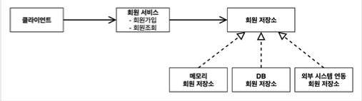
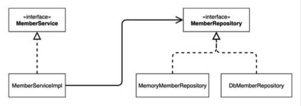

# 스프링 핵심 원리 - 기본편

## 목차

1. 객체 지향 설계와 스프링

2. 스프링 핵심 원리 이해 1 - 예제 만들기

3. 스프링 핵심 원리 이해 2 - 객체 지향 원리 적용

4. 스프링 컨테이너와 스프링 빈

5. 싱글톤 컨테이너

6. 컴포넌트 스캔

7. 의존 관계 자동 주입

8. 빈 생명 주기 콜백

9. 빈 스코프

10. 다음으로

## 1. 객체 지향 설계와 스프링

### 목차

[1] 이야기 - 자바 진영의 추운 겨울과 스프링의 탄생

[2] 스프링이란?

[3] 좋은 객체 지향 프로그래밍이란?

[4] 좋은 객체 지향 설계의 5가지 원칙(SOLID)

[5] 객체 지향 설계와 스프링

## 2. 스프링 핵심 원리 이해 1 - 예제 만들기

### 목차

[1] 프로젝트 생성

[2] 비즈니스 요구사항과 설계

[3] 회원 도메인 설계

[4] 회원 도메인 개발

[5] 회원 도메인 실행과 테스트

[6] 주문과 할인 도메인 설계

[7] 주문과 할인 도메인 개발

[8] 주문과 할인 도메인 실행과 테스트

### [1] 프로젝트 생성

#### 사전 준비물
- Java 11
- IDE: IntelliJ or Eclipse
  

#### Spring Boot Starter에서 Spring 프로젝트 생성
- [start.spring.io](https://start.spring.io/)
  - 프로젝트 설정
    - Project: Gradle - Groovy Project
    - Language: Java
    - Spring Boot: 2.7.9
    - Project Metadata
      - group: com.k1m743hyun
      - Artifact: core-spring
      - Packaging: Jar
      - Java: 11
    - Dependencies: 선택하지 않음
  - 설정 완료 후 Generate 클릭
  - zip 파일 다운로드 완료 후 압축 해제
  - IntelliJ 실행 후 압축 해제한 디렉토리 열기

#### 동작 확인
- 기본 메인 클래스(`CoreSpringApplication.main()`) 실행

#### IntelliJ Gradle 대신에 Java 직접 실행
- 최근 IntelliJ 버전은 Gradle을 통해서 실행하는 것이 기본 설정
- 이렇게 설정되어 있으면 실행 속도가 느림
- 다음과 같이 변경하면 Java로 바로 실행해서 실행 속도가 더 빠름
    - Preferences -> Build, Execution, Deployment -> Build Tools -> Gradle
        - Build and run using: Gradle -> IntelliJ IDEA
        - Run tests using: Gradle -> IntelliJ IDEA

### [2] 비즈니스 요구사항과 설계
- 회원
  - 회원을 가입하고 조회할 수 있음
  - 회원은 일반과 VIP 두 가지 등급이 있음
  - 회원 데이터는 자체 DB를 구축하거나 외부 시스템과 연동할 수 있음 (미확정)

- 주문과 할인 정책
  - 회원은 상품을 주문할 수 있음
  - 회원 등급에 따라 할인 정책을 적용할 수 있음
  - 할인 정책은 모든 VIP에게 1000원을 할인해주는 고정 금액 할인을 적용해달라 (나중에 변경될 수 있음)
  - 할인 정책은 변경 가능성이 높음
    - 회사의 기본 할인 정책을 아직 정하지 못 했음
    - 오픈 직전까지 고민을 미루고 싶음
    - 최악의 경우 할인을 적용하지 않을 수도 있음 (미확정)

- 요구사항을 보면 회원 데이터, 할인 정책 같은 부분은 지금 결정하기 어려운 부분이 있음
- 그렇다고 이런 정책이 결정될 때까지 개발을 무기한 미룰 수 없음
- 객체 지향 설계 방법을 사용하여 인터페이스를 만들고 구현체를 언제든지 갈아끼울 수 있도록 설계해보자

### [3] 회원 도메인 설계
- 회원 도메인 요구사항
  - 회원을 가입하고 조회할 수 있음
  - 회원은 일반과 VIP 두 가지 등급이 있음
  - 회원 데이터는 자체 DB를 구축하거나 외부 시스템과 연동할 수 있음 (미확정)

#### 회원 도메인 협력 관계

#### 회원 클래스 다이어그램

#### 회원 객체 다이어그램

