# 스프링 핵심 원리 - 기본편


## 목차

1. 객체 지향 설계와 스프링

2. 스프링 핵심 원리 이해 1 - 예제 만들기

3. 스프링 핵심 원리 이해 2 - 객체 지향 원리 적용

4. 스프링 컨테이너와 스프링 빈

5. 싱글톤 컨테이너

6. 컴포넌트 스캔

7. 의존 관계 자동 주입

8. 빈 생명 주기 콜백

9. 빈 스코프

10. 다음으로


## 1. 객체 지향 설계와 스프링


### 목차

[1] 이야기 - 자바 진영의 추운 겨울과 스프링의 탄생

[2] 스프링이란?

[3] 좋은 객체 지향 프로그래밍이란?

[4] 좋은 객체 지향 설계의 5가지 원칙(SOLID)

[5] 객체 지향 설계와 스프링


## 2. 스프링 핵심 원리 이해 1 - 예제 만들기


### 목차

[1] 프로젝트 생성

[2] 비즈니스 요구사항과 설계

[3] 회원 도메인 설계

[4] 회원 도메인 개발

[5] 회원 도메인 실행과 테스트

[6] 주문과 할인 도메인 설계

[7] 주문과 할인 도메인 개발

[8] 주문과 할인 도메인 실행과 테스트


### [1] 프로젝트 생성


#### 사전 준비물
- Java 11
- IDE: IntelliJ or Eclipse
  

#### Spring Boot Starter에서 Spring 프로젝트 생성
- [start.spring.io](https://start.spring.io/)
  - 프로젝트 설정
    - Project: Gradle - Groovy Project
    - Language: Java
    - Spring Boot: 2.7.9
    - Project Metadata
      - group: com.k1m743hyun
      - Artifact: core-spring
      - Packaging: Jar
      - Java: 11
    - Dependencies: 선택하지 않음
  - 설정 완료 후 Generate 클릭
  - zip 파일 다운로드 완료 후 압축 해제
  - IntelliJ 실행 후 압축 해제한 디렉토리 열기


#### 동작 확인
- 기본 메인 클래스(`CoreSpringApplication.main()`) 실행


#### IntelliJ Gradle 대신에 Java 직접 실행
- 최근 IntelliJ 버전은 Gradle을 통해서 실행하는 것이 기본 설정
- 이렇게 설정되어 있으면 실행 속도가 느림
- 다음과 같이 변경하면 Java로 바로 실행해서 실행 속도가 더 빠름
    - Preferences -> Build, Execution, Deployment -> Build Tools -> Gradle
        - Build and run using: Gradle -> IntelliJ IDEA
        - Run tests using: Gradle -> IntelliJ IDEA


### [2] 비즈니스 요구사항과 설계
- 회원
  - 회원을 가입하고 조회할 수 있음
  - 회원은 일반과 VIP 두 가지 등급이 있음
  - 회원 데이터는 자체 DB를 구축하거나 외부 시스템과 연동할 수 있음 (미확정)

- 주문과 할인 정책
  - 회원은 상품을 주문할 수 있음
  - 회원 등급에 따라 할인 정책을 적용할 수 있음
  - 할인 정책은 모든 VIP에게 1000원을 할인해주는 고정 금액 할인을 적용해달라 (나중에 변경될 수 있음)
  - 할인 정책은 변경 가능성이 높음
    - 회사의 기본 할인 정책을 아직 정하지 못 했음
    - 오픈 직전까지 고민을 미루고 싶음
    - 최악의 경우 할인을 적용하지 않을 수도 있음 (미확정)

- 요구사항을 보면 회원 데이터, 할인 정책 같은 부분은 지금 결정하기 어려운 부분이 있음
- 그렇다고 이런 정책이 결정될 때까지 개발을 무기한 미룰 수 없음
- 객체 지향 설계 방법을 사용하여 인터페이스를 만들고 구현체를 언제든지 갈아끼울 수 있도록 설계해보자


### [3] 회원 도메인 설계
- 회원 도메인 요구사항
  - 회원을 가입하고 조회할 수 있음
  - 회원은 일반과 VIP 두 가지 등급이 있음
  - 회원 데이터는 자체 DB를 구축하거나 외부 시스템과 연동할 수 있음 (미확정)


#### 회원 도메인 협력 관계


#### 회원 클래스 다이어그램


#### 회원 객체 다이어그램


### [4] 회원 도메인 개발


#### 회원 엔티티


##### 회원 등급
- [Grade.java](https://github.com/k1m743hyun/spring-exercise/blob/main/core-spring/src/main/java/com/k1m743hyun/corespring/member/Grade.java)


##### 회원 엔티티
- [Member.java](https://github.com/k1m743hyun/spring-exercise/blob/main/core-spring/src/main/java/com/k1m743hyun/corespring/member/Member.java)


#### 회원 저장소


##### 회원 저장소 인터페이스
- [MemberRepository.java](https://github.com/k1m743hyun/spring-exercise/blob/main/core-spring/src/main/java/com/k1m743hyun/corespring/member/MemberRepository.java)


##### 메모리 회원 저장소 구현체
- [MemoryMemberRepository.java](https://github.com/k1m743hyun/spring-exercise/blob/main/core-spring/src/main/java/com/k1m743hyun/corespring/member/MemoryMemberRepository.java)


- 데이터베이스가 아직 확정이 안되었음
  - 그래도 개발은 진행해야하니 가장 단순한 메모리 회원 저장소를 구현해서 우선 개발을 진행하자
- 참고) `HashMap`은 동시성 이슈가 발생할 수 있음
  - 이런 경우 `ConcurrentHashMap`을 사용하자


#### 회원 서비스


##### 회원 서비스 인터페이스
- [MemberService.java](https://github.com/k1m743hyun/spring-exercise/blob/main/core-spring/src/main/java/com/k1m743hyun/corespring/member/MemberService.java)


##### 회원 서비스 구현체
- [MemberServiceImpl.java](https://github.com/k1m743hyun/spring-exercise/blob/main/core-spring/src/main/java/com/k1m743hyun/corespring/member/MemberServiceImpl.java)


### [5] 회원 도메인 실행과 테스트


#### 회원 도메인 - 회원 가입 main
- [MemberApp.java]](https://github.com/k1m743hyun/spring-exercise/blob/main/core-spring/src/main/java/com/k1m743hyun/corespring/MemberApp.java)
- 애플리케이션 로직으로 이렇게 테스트 하는 것은 좋은 방법이 아님
  - JUnit 테스트를 사용하자


#### 회원 도메인 - 회원 가입 테스트
- [CoreSpringApplicationTests.java ](https://github.com/k1m743hyun/spring-exercise/blob/main/core-spring/src/test/java/com/k1m743hyun/corespring/CoreSpringApplicationTests.java)


#### 회원 도메인 설계의 문제점
- 이 코드의 설계 상 문제점은 무엇일까?
  - 다른 저장소로 변경할 때 OCP 원칙을 잘 준수하는가?
  - DIP를 잘 지키고 있는가?
  - 의존 관계가 인터페이스 뿐만 아니라 구현까지 모두 의존하는 문제점이 있음


### [6] 주문과 할인 도메인 설계
- 주문과 할인 정책
  - 회원은 상품을 주문할 수 있음
  - 회원 등급에 따라 할인 정책을 적용할 수 있음
  - 할인 정책은 모든 VIP에게 1000원을 할인해주는 고정 금액 할인을 적용해달라 (나중에 변경될 수 있음)
  - 할인 정책은 변경 가능성이 높음
    - 회사의 기본 할인 정책을 아직 정하지 못 했음
    - 오픈 직전까지 고민을 미루고 싶음
    - 최악의 경우 할인을 적용하지 않을 수도 있음 (미확정)


#### 주문 도메인 협력, 역할, 책임

- (1) 주문 생성
  - 클라이언트는 주문 서비스에 주문 생성을 요청
- (2) 회원 조회
  - 할인을 위해서는 회원 등급이 필요
  - 그래서 주문 서비스는 회원 저장소에서 회원을 조회함
- (3) 할인 적용
  - 주문 서비스는 회원 등급에 따른 할인 여부를 할인 정책에 위임함
- (4) 주문 결과 반환
  - 주문 서비스는 할인 결과를 포함한 주문 결과를 반환함
- 참고) 실제로는 주문 데이터를 DB에 저장하겠지만, 예제가 너무 복잡해질 수 있어서 생략하고, 단순히 주문 결과를 반환함


#### 주문 도메인 전체
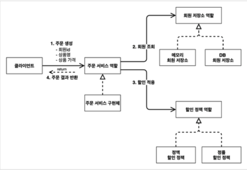
- *역할과 구현을 분리*해서 자유롭게 구현 객체를 조립할 수 있게 설계
  - 덕분에 회원 저장소는 물론이고, 할인 정책도 유연하게 변경할 수 있음


#### 주문 도메인 클래스 다이어그램


#### 주문 도메인 객체 다이어그램 1
.png)
- 회원을 메모리에서 조회하고, 정액 할인 정책(고정 금액)을 지원해도 주문 서비스를 변경하지 않아도 됨
- 역할들의 협력 관계를 그대로 재사용할 수 있음


#### 주문 도메인 객체 다이어그램 2
.png)
- 회원을 메모리가 아닌 실제 DB에서 조회하고, 정률 할인 정책(주문 금액에 따라 % 할인)을 지원해도 주문 서비스를 변경하지 않아도 됨
- 협력 관계를 그대로 재사용할 수 있음


### [7] 주문과 할인 도메인 개발


#### 할인 정책 인터페이스
- [DiscountPolicy.java](https://github.com/k1m743hyun/spring-exercise/blob/main/core-spring/src/main/java/com/k1m743hyun/corespring/discount/DiscountPolicy.java)


#### 정액 할인 정책 구현체
- [FixDiscountPolicy.java](https://github.com/k1m743hyun/spring-exercise/blob/main/core-spring/src/main/java/com/k1m743hyun/corespring/discount/FixDiscountPolicy.java)
- VIP면 1000원 할인, 아니면 할인 없음

#### 주문 엔티티
- [Order.java](https://github.com/k1m743hyun/spring-exercise/blob/main/core-spring/src/main/java/com/k1m743hyun/corespring/order/Order.java)


#### 주문 서비스 인터페이스
- [OrderService.java](https://github.com/k1m743hyun/spring-exercise/blob/main/core-spring/src/main/java/com/k1m743hyun/corespring/order/OrderService.java)


#### 주문 서비스 구현체
- [OrderServiceImpl.java](https://github.com/k1m743hyun/spring-exercise/blob/main/core-spring/src/main/java/com/k1m743hyun/corespring/order/OrderServiceImpl.java)
- 주문 생성 요청이 오면, 회원 정보를 조회하고, 할인 정책을 적용한 다음 주문 객체를 생성해서 반환함
- **메모리 회원 리포지토리와, 고정 금액 할인 정책을 구현체로 생성함**


### [8] 주문과 할인 도메인 실행과 테스트


#### 주문과 할인 정책 실행
- [OrderApp.java](https://github.com/k1m743hyun/spring-exercise/blob/main/core-spring/src/main/java/com/k1m743hyun/corespring/OrderApp.java)
- 애플리케이션 로직으로 이렇게 테스트하는 것은 좋은 방법은 아님
  - JUnit 테스트를 사용하자


#### 주문과 할인 정책 테스트
- [OrderServiceTest.java](https://github.com/k1m743hyun/spring-exercise/blob/main/core-spring/src/test/java/com/k1m743hyun/corespring/order/OrderServiceTest.java)


## 3. 스프링 핵심 원리 이해 2 - 객체 지향 원리 적용


### 목차

[1] 새로운 할인 정책 개발

[2] 새로운 할인 정책 적용과 문제점

[3] 관심사의 분리

[4] AppConfig 리팩터링

[5] 새로운 구조와 할인 정책 적용

[6] 전체 흐름 정리

[7] 좋은 객체 지향 설계의 5가지 원칙의 적용

[8] IoC, DI, 그리고 컨테이너

[9] 스프링으로 전환하기


### [1] 새로운 할인 정책 개발
- 새로운 할인 정책을 확장해보자
  - 주문한 금액의 %를 할인해주는 새로운 정률 할인 정책을 추가하자
- 참고) 애자일 소프트웨어 개발 선언
  - https://agilemanifesto.org/iso/ko/manifesto.html


#### RateDiscountPolicy 추가


#### RateDiscountPolicy 코드 추가
- [RateDiscountPolicy.java](https://github.com/k1m743hyun/spring-exercise/blob/main/core-spring/src/main/java/com/k1m743hyun/corespring/discount/RateDiscountPolicy.java)


#### 테스트 작성
- [RateDiscountPolicyTest.java](https://github.com/k1m743hyun/spring-exercise/blob/main/core-spring/src/test/java/com/k1m743hyun/corespring/discount/RateDiscountPolicyTest.java)


### [2] 새로운 할인 정책 적용과 문제점
- 방금 추가한 할인 정책을 애플리케이션에 적용해보자
  - 할인 정책을 변경하려면 클라이언트인 `OrderServiceImpl` 코드를 고쳐야 함
  - [OrderServiceImpl.java](https://github.com/k1m743hyun/spring-exercise/blob/main/core-spring/src/main/java/com/k1m743hyun/corespring/order/OrderServiceImpl.java)

#### 문제점 발견
- 역할과 구현을 충실하게 분리함
- 다형성도 활용하고, 인터페이스와 구현 객체를 분리함
- OCP, DIP 같은 객체지향 설계 원칙을 충실히 준수함
  - 그렇게 보이지만 사실 아님
  - 주문 서비스 클라이언트(`OrderServiceImpl`)는 `DiscountPolicy` 인터페이스에 의존하면서 DIP를 지킨 것 같다?
    - 클래스 의존 관계를 분석해보면, 인터페이스 뿐만 아니라 **구현 클래스**에도 의존하고 있음
      - 인터페이스: `DiscountPolicy`
      - 구현 클래스: `FixDiscountPolicy`, `RateDiscountPolicy`
  - 변경하지 않고 확장할 수 있다고 했지만
    - *지금 코드에서는 기능을 확장해서 변경하면, 클라이언트 코드에 영향을 준다!*
    - 따라서 **OCP를 위반**한 것임


#### 왜 클라이언트 코드를 변경해야 할까?


##### 기대했던 의존 관계

- `DiscountPolicy` 인터페이스만 의존한다고 생각했지만


##### 실제 의존 관계

- 클라이언트인 `OrderServiceImpl`이 `DiscountPolicy` 인터페이스 뿐만 아니라 `FixDiscountPolicy`인 구현 클래스도 함께 의존하고 있음
- **DIP 위반**


##### 정책 변경

- 중요!) `FixDiscountPolicy`를 `RateDiscountPolicy`로 변경하는 순간 `OrderServiceImpl`의 소스 코드도 함께 변경해야 함
- **OCP 위반**


##### 어떻게 문제를 해결할 수 있을까?
- 클라이언트 코드인 `OrderServiceImpl`은 `DiscountPolicy`의 인터페이스 뿐만 아니라 구현 클래스도 함께 의존함
- 그래서 구현 클래스를 변경할 때 클라이언트 코드도 함께 변경해야 함
- **DIP 위반** => 인터페이스에만 의존하도록 변경
- DIP를 위반하지 않도록 인터페이스에만 의존하도록 의존 관계를 변경하면 됨


##### 인터페이스에만 의존하도록 설계를 변경하자


##### 인터페이스만 의존하도록 코드 변경
- [OrderServiceImpl.java](https://github.com/k1m743hyun/spring-exercise/blob/main/core-spring/src/main/java/com/k1m743hyun/corespring/order/OrderServiceImpl.java)
- 인터페이스에만 의존하도록 설계와 코드를 변경함
- *그런데 구현체가 없는데 어떻게 코드를 실행할 수 있을까?*
- 실제 실행을 해보면 NPE(Null Pointer Exception)가 발생함


##### 해결 방안
- 이 문제를 해결하려면 누군가가 클라이언트인 `OrderServiceImpl`에 `DiscountPolicy`의 구현 객체를 대신 생성하고 주입해주어야 함


### [3] 관심사의 분리
- 애플리케이션을 하나의 공연이라고 생각해보자
- 각각의 인터페이스를 배역(배우 역할)이라 생각하자
- 남자 주인공을 누가할 지, 여자 주인공을 누가할 지는 배우들이 선택하는 것이 아님
- 이전에 작성한 코드는 마치 남자 주인공으로 선택된 배우가 여자 주인공을 직접 선택하는 것과 같음
- 남자 주인공으로 선택된 배우는 남자 주인공 역할과 동시에 여자 주인공을 선택하는 역할을 가지므로 여러 책임으로 가지고 있음 


#### 관심사를 분리하자
- 배우는 본인의 역할인 배역을 수행하는 것에만 집중해야 함
  - 남자 주인공은 어떤 여자 주인공이 선택되더라도 똑같이 공연할 수 있어야 함
- 역할에 맞는 배우를 선택하는 책임을 갖는 별도의 *공연 기획자*가 나올 시점
- 수정할 코드에서는 공연 기획자를 생성하고, 배우와 공연 기획자의 책임을 확실히 분리하도록 하자


#### AppConfig 등장
- 애플리케이션의 전체 동작 방식을 구성(Config)하기 위해, *구현 객체를 생성*하고, *연결*하는 책임을 가지는 별도의 설정 클래스를 만들자


##### AppConfig
- [AppConfig.java](https://github.com/k1m743hyun/spring-exercise/tree/main/core-spring/src/main/java/com/k1m743hyun/corespring/AppConfig.java)
- AppConfig는 애플리케이션의 실제 동작에 필요한 *구현 객체를 생성*
  - `MemberServiceImpl`
  - `MemoryMemberRepository`
  - `OrderServiceImpl`
  - `FixDiscountPolicy`
- AppConfig는 생성한 객체 인스턴스의 참조(레퍼런스)를 생성자를 통해서 주입(연결)
  - `MemberServiceImpl` => `MemoryMemberRepository`
  - `OrderServiceImpl` => `MemoryMemberRepository`, `FixDiscountPolicy`


##### MemberServiceImpl - 생성자 주입
- [MemberServiceImpl.java](https://github.com/k1m743hyun/spring-exercise/blob/main/core-spring/src/main/java/com/k1m743hyun/corespring/member/MemberServiceImpl.java)
- 설계 변경으로 `MemberServiceImpl`은 `MemoryMemberRepository`를 의존하지 않음
- 단지 `MemberRepository` 인터페이스만 의존
- `MemberServiceImpl` 입장에서 생성자를 통해 어떤 구현 객체가 들어올 지(주입될 지)는 알 수 없음
- `MemberServiceImpl`의 생성자를 통해서 어떤 구현 객체를 주입할 지는 오직 외부(`AppConfig`)에서 결정됨
- `MemberServiceImpl`은 이제부터 *의존 관계에 대한 고민은 외부*에 맡기고 *실행에만 집중*하면 됨


##### 클래스 다이어그램

- 객체의 생성과 연결은 `AppConfig`가 담당
- DIP 완성
  - `MemberServiceImpl`은 `MemberRepository`인 인터페이스에만 의존하면 됨
  - 이제 구현 클래스를 몰라도 됨
- 관심사의 분리
  - 객체를 생성하고 연결하는 역할과 실행하는 역할이 명확히 분리됨


##### 회원 객체 인스턴스 다이어그램

- `appConfig` 객체는 `memoryMemberRepository` 객체를 생성하고 그 참조값을 `memberServiceImpl`을 생성하면서 생성자로 전달함
- 클라이언트인 `memberServiceImpl` 입장에서 보면 의존 관계를 마치 외부에서 주입해주는 것 같다고 해서 DI(Dependency Injection) 우리말로 *의존 관계 주입* 또는 *의존성 주입*이라 함


##### OrderServiceImpl - 생성자 주입
- [OrderServiceImpl.java](https://github.com/k1m743hyun/spring-exercise/blob/main/core-spring/src/main/java/com/k1m743hyun/corespring/order/OrderServiceImpl.java)
- 설계 변경으로 `OrderServiceImpl`은 `FixDiscountPolicy`를 의존하지 않음
- 단지 `DiscountPolicy` 인터페이스만 의존함
- `OrderServiceImpl` 입장에서 생성자를 통해 어떤 구현 객체가 들어올 지(주입될 지)는 알 수 없음
- `OrderServiceImpl`의 생성자를 통해서 어떤 구현 객체를 주입할 지는 오직 외부(`AppConfig`)에서 결정함
- `OrderServiceImpl`은 이제부터 실행에만 집중하면 됨
- `OrderServiceImpl`에는 `MemoryMemberRepository`, `FixDiscountPolicy` 객체의 의존 관계가 주입됨


#### AppConfig 실행


##### MemberApp
- [MemberApp.java](https://github.com/k1m743hyun/spring-exercise/tree/main/core-spring/src/main/java/com/k1m743hyun/corespring/MemberApp.java)


##### OrderApp
- [OrderApp.java](https://github.com/k1m743hyun/spring-exercise/tree/main/core-spring/src/main/java/com/k1m743hyun/corespring/OrderApp.java)


##### 테스트 코드 오류 수정
- [MemberServiceTest.java](https://github.com/k1m743hyun/spring-exercise/blob/main/core-spring/src/test/java/com/k1m743hyun/corespring/member/MemberServiceTest.java)
- [OrderServiceTest.java](https://github.com/k1m743hyun/spring-exercise/blob/main/core-spring/src/test/java/com/k1m743hyun/corespring/order/OrderServiceTest.java)
- 테스트 코드에서 `@BeforeEach`는 각 테스트를 실행하기 전에 호출됨


##### 정리
- `AppConfig`를 통해서 관심사를 확실하게 분리함
- 배역, 배우를 생각해보자
- `AppConfig`는 공연 기획자
- `AppConfig`는 구현 클래스를 선택함
  - 배역에 맞는 담당 배우를 선택함
  - 애플리케이션이 어떻게 동작해야 할지 전체 구성을 책임짐
- 이제 각 배우들은 담당 기능을 실행하는 책임만 지면 됨
- `OrderServiceImpl`은 기능을 실행하는 책임만 지면 됨


### [4] AppConfig 리팩터링
- 위에서 작성된 `AppConfig`를 보면 **중복**이 있고, **역할**에 따른 **구현**이 잘 안보임


#### 기대하는 그림


#### AppConfig 리팩터링
- 중복을 제거하고, 역할에 따른 구현이 보이도록 리팩터링 하자
- [AppConfig.java](https://github.com/k1m743hyun/spring-exercise/tree/main/core-spring/src/main/java/com/k1m743hyun/corespring/AppConfig.java)
- `new MemoryMemberRepository()` 이 부분이 중복 제거됨
- 이제 `MemoryMemberRepository`를 다른 구현체로 변경할 때 한 부분만 변경하면 됨
- `AppConfig`를 보면 역할과 구현 클래스가 한눈에 들어옴
- 애플리케이션 전체 구성이 어떻게 되어있는지 빠르게 파악할 수 있음


### [5] 새로운 구조와 할인 정책 적용
- 정액 할인 정책(`FixDiscountPolicy`)을 정률 할인 정책(`RateDiscountPolicy`)으로 변경해보자
- `AppConfig`의 등장으로 애플리케이션이 크게 사용 영역과, 객체를 생성하고 구성(Configuration)하는 영역으로 분리


#### 사용, 구성의 분리


#### 할인 정책의 변경

- `FixDiscountPolicy` => `RateDiscountPolicy`로 변경해도 구성 영역만 영향을 받고, 사용 영역은 전혀 영향을 받지 않음


#### 할인 정책 변경 구성 코드
- [AppConfig.java](https://github.com/k1m743hyun/spring-exercise/tree/main/core-spring/src/main/java/com/k1m743hyun/corespring/AppConfig.java)
- `AppConfig`에서 할인 정책 역할을 담당하는 구현을 `FixDiscountPolicy` => `RateDiscountPolicy` 객체로 변경함
- 이제 할인 정책을 변경해도, 애플리케이션의 구성 역할을 담당하는 `AppConfig`만 변경하면 됨
  - 클라이언트 코드인 `OrderServiceImpl`를 포함해서 **사용 영역**의 어떤 코드도 변경할 필요가 없음
- **구성 영역**은 당연히 변경이 됨
  - 구성 역할을 담당하는 `AppConfig`는 구현 객체들을 모두 알아야 함


### [6] 전체 흐름 정리
- 새로운 할인 정책 개발
- 새로운 할인 정책 적용과 문제점
- 관심사의 분리
- `AppConfig` 리팩터링
- 새로운 구조와 할인 정책 적용


#### 새로운 할인 정책 개발
- 다형성 덕분에 새로운 정률 할인 정책 코드를 추가로 개발하는 것 자체는 아무 문제가 없음


#### 새로운 할인 정책 적용과 문제점
- 새로 개발한 정률 할인 정책을 적용하려고 하니 **클라이언트 코드**인 주문 서비스 구현체도 함께 변경해야 함
- 주문 서비스 클라이언트가 인터페이스인 `DiscountPolicy` 뿐만 아니라, 구체 클래스인 `FixDiscountPolicy`도 함께 의존 => **DIP 위반**


#### 관심사의 분리
- 애플리케이션을 하나의 공연으로 생각
- 기존에는 클라이언트가 의존하는 서버 구현 객체를 직접 생성하고, 실행함
- 비유를 하면 기존에는 남자 주인공 배우가 공연도 하고, 동시에 여자 주인공도 직접 초빙하는 다양한 책임을 가지고 있음
- 공연을 구성하고, 담당 배우를 섭외하고, 지정하는 책임을 담당하는 별도의 **공연 기획자**가 나올 시점
- 공연 기획자인 `AppConfig`가 등장
- `AppConfig`는 애플리케이션의 전체 동작 방식을 구성(config)하기 위해, **구현 객체를 생성**하고, **연결**하는 책임
- 이제부터 클라이언트 객체는 자신의 역할을 실행하는 것만 집중
  - 권한이 줄어듬
  - 책임이 명확해짐


#### `AppConfig` 리팩터링
- 구성 정보에서 역할과 구현을 명확하게 분리
- 역할이 잘 드러남
- 중복 제거


#### 새로운 구조와 할인 정책 적용
- 정액 할인 정책 => 정률 할인 정책으로 변경
- `AppConfig`의 등장으로 애플리케이션이 크게 **사용 영역**과, 객체를 생성하고 **구성(Configuration)하는 영역**으로 분리
- 할인 정책을 변경해도 `AppConfig`가 있는 구성 영역만 변경하면 됨
  - 사용 영역은 변경할 필요가 없음
  - 물론 클라이언트 코드인 주문 서비스 코드도 변경하지 않음


### [7] 좋은 객체 지향 설계의 5가지 원칙 적용
- 위 예제에서 **SRP**, **DIP**, **OCP** 3가지 적용


#### SRP - 단일 책임 원칙
> 한 클래스는 하나의 책임만 가져야 함
- 클라이언트 객체는 직접 구현 객체를 생성하고, 연결하고, 실행하는 다양한 책임을 가지고 있음
- SRP 단일 책임 원칙을 따르면서 관심사를 분리함
- 구현 객체를 생성하고 연결하는 책임은 `AppConfig`가 담당
- 클라이언트 객체는 실행하는 책임만 담당


#### DIP - 의존 관계 역전 원칙
> 프로그래머는 "추상화에 의존해야지, 구체화에 의존하면 안됨"<br>
> 의존성 주입은 이 원칙을 따르는 방법 중 하나
- 새로운 할인 정책을 개발하고, 적용하려고 하니 클라이언트 코드도 함께 변경해야 했음
  - 왜냐하면 기존 클라이언트 코드(`OrderServiceImpl`)는 DIP를 지키며 `DiscountPolicy` 추상화 인터페이스에 의존하는 것 같았지만, `FixDiscountPolicy` 구체화 구현 클래스에도 함께 의존했음
- 클라이언트 코드가 `DiscountPolicy` 추상화 인터페이스에만 의존하도록 코드를 변경함
- 하지만 클라이언트 코드는 인터페이스만으로는 아무것도 실행할 수 없음
- `AppConfig`가 `FixDiscountPolicy` 객체 인스턴스를 클라이언트 코드 대신 생성해서 클라이언트 코드에 의존 관계를 주입했음
- 이렇게 해서 DIP 원칙을 따르면서 문제도 해결했음


#### OCP - 개방 폐쇄 원칙
> 소프트웨어 요소는 확장에는 열려 있으나 변경에는 닫혀 있어야 함
- 다형성 사용하고 클라이언트가 DIP를 지킴
- 애플리케이션을 사용 영역과 구성 영역으로 나눔
- `AppConfig`가 의존 관계를 `FixDiscountPolicy` => `RateDiscountPolicy`로 변경해서 클라이언트 코드에 주입하므로 클라이언트 코드는 변경하지 않아도 됨
- **"소프트웨어 요소를 새롭게 확장해도 사용 영역의 변경은 닫혀 있음"**


### [8] IoC, DI, 그리고 컨테이너


#### IoC(Inversion of Control) - 제어의 역전
- 기존 프로그램은 클라이언트 구현 객체가 스스로 필요한 서버 구현 객체를 생성하고, 연결하고, 실행했음
  - 한마디로 구현 객체가 프로그램의 제어 흐름을 스스로 조종했음
  - 개발자 입장에서는 자연스러운 흐름임
- 반면에 `AppConfig`가 등장한 이후에 구현 객체는 자신의 로직을 실행하는 역할만 담당함
  - 프로그램의 제어 흐름은 이제 `AppConfig`가 가져감
  - 예를 들어서 `OrderServiceImpl`은 필요한 인터페이스들을 호출하지만 어떤 구현 객체들이 실행될 지 모름
- 프로그램에 대한 제어 흐름에 대한 권한은 모두 `AppConfig`가 가지고 있음
  - 심지어 `OrderServiceImpl`도 `AppConfig`가 생성함
  - 그리고 `AppConfig`는 `OrderServiceImpl`이 아닌 `OrderService` 인터페이스의 다른 구현 객체를 생성하고 실행할 수도 있음
  - 그런 사실도 모른체 `OrderServiceImpl`은 묵묵히 자신의 로직을 실행할 뿐임
- 이렇듯 프로그램의 제어 흐름을 직접 제어하는 것이 아니라 외부에서 관리하는 것을 제어의 역전(IoC)이라 함


#### 프레임워크 VS 라이브러리
- 프레임워크가 내가 작성한 코드를 제어하고, 대신 실행하면 그것은 프레임워크가 맞음 (JUnit)
- 반면에 내가 작성한 코드가 직접 제어의 흐름을 담당한다면 그것은 프레임워크가 아니라 라이브러리임


#### DI(Dependency Injection) - 의존 관계 주입
- `OrderServiceImpl`은 `DiscountPolicy` 인터페이스에 의존함
  - 실제 어떤 구현 객체가 사용될 지는 모름
- 의존 관계는 정적인 클래스 의존 관계와, 실행 시점에 결졍되는 동적인 객체(인스턴스) 의존 관계 둘을 분리해서 생각해야 함


#### 정적인 클래스 의존 관계
- 클래스가 사용하는 import 코드만 보고 의존 관계를 쉽게 판단할 수 있음
- 정적인 의존 관계는 애플리케이션을 실행하지 않아도 분석할 수 있음
  - 클래스 다이어그램을 보면 `OrderServiceImpl`은 `MemberRepository`, `DiscountPolicy`에 의존한다는 것을 알 수 있음
- 그런데 이러한 클래스 의존 관계만으로는 실제 어떤 객체가 `OrderServiceImpl`에 주입될 지 알 수 없음


#### 클래스 다이어그램


#### 동적인 객체 인스턴스 의존 관계
- 애플리케이션 실행 시점에 실제 생성된 객체 인스턴스의 참조가 연결된 의존 관계임


#### 객체 다이어그램
.png)
- 애플리케이션 **실행 시점(런타임)**에 외부에서 실제 구현 객체를 생성하고 클라이언트에 전달해서 클라이언트와 서버의 실제 의존 관계가 연결되는 것을 **의존 관계 주입**이라 함
- 객체 인스턴스를 생성하고, 그 참조 값을 전달해서 연결됨
- 의존 관계 주입을 사용하면 클라이언트 코드를 변경하지 않고, 클라이언트가 호출하는 대상의 타입 인스턴스를 변경할 수 있음
- 의존 관계 주입을 사용하면 정적인 클래스 의존 관계를 변경하지 않고, 동적인 객체 인스턴스 의존 관계를 쉽게 변경할 수 있음


#### IoC 컨테이너, DI 컨테이너
- `AppConfig`처럼 객체를 생성하고 관리하면서 의존 관계를 연결해주는 것을 *IoC 컨테이너* 또는 *DI 컨테이너*라 함
- 의존 관계 주입에 초점을 맞추어 최근에는 주로 DI 컨테이너라 함
- 또는 어셈블러, 오브젝트 팩토리 등으로 불리기도 함


### [9] 스프링으로 전환하기
- 위 예제는 순수한 Java 코드만으로 DI를 적용함
- 이제 스프링을 사용해보자

#### AppConfig 스프링 기반으로 변경
- [AppConfig.java](https://github.com/k1m743hyun/spring-exercise/tree/main/core-spring/src/main/java/com/k1m743hyun/corespring/AppConfig.java)
- `AppConfig`에 설정을 구성한다는 뜻의 `@Configuration`을 붙여줌
- 각 메서드에 `@Bean`을 붙여줌으로 스프링 컨테이너에 스프링 빈으로 등록함


#### MemberApp에 스프링 컨테이너 적용
- [MemberApp.java](https://github.com/k1m743hyun/spring-exercise/tree/main/core-spring/src/main/java/com/k1m743hyun/corespring/MemberApp.java)
- 스프링 관련 로그가 몇 줄 실행되면서 기존과 동일한 결과가 출력됨


#### OrderApp에 스프링 컨테이너 적용
- [OrderApp.java](https://github.com/k1m743hyun/spring-exercise/tree/main/core-spring/src/main/java/com/k1m743hyun/corespring/OrderApp.java)
- 스프링 관련 로그가 몇 줄 실행되면서 기존과 동일한 결과가 출력됨


#### 스프링 컨테이너
- `ApplicationContext`를 스프링 컨테이너라 함
- 기존에는 개발자가 `AppConfig`를 사용해서 직접 객체를 생성하고 DI를 했지만, 이제부터는 스프링 컨테이너를 통해서 사용함
- 스프링 컨테이너는 `@Configuration`이 붙은 `AppConfig`를 설정(구성) 정보로 사용함
  - 여기서 `@Bean`이라 적힌 메서드를 모두 호출해서 반환된 객체를 스프링 컨테이너에 등록함
  - 이렇게 스프링 컨테이너에 등록된 객체를 *스프링 빈*이라 함
- 스프링 빈은 `@Bean`이 붙은 메서드 명을 스프링 빈의 이름으로 사용함 (`memeberService`, `orderService`)
- 이전에는 개발자가 필요한 객체를 `AppConfig`를 사용해서 직접 조회했지만, 이제부터는 스프링 컨테이너를 통해서 필요한 스프링 빈(객체)를 찾아야 함
  - 스프링 빈은 `applicationContext.getBean()` 메서드를 사용해서 찾을 수 있음
- 기존에는 개발자가 직접 자바 코드로 모든 것을 했다면 이제부터는 스프링 컨테이너에 객체를 스프링 빈으로 등록하고, 스프링 컨테이너에서 스프링 빈을 찾아서 사용하도록 변경되었음


## 4. 스프링 컨테이너와 스프링 빈


### 목차

[1] 스프링 컨테이너 생성

[2] 컨테이너에 등록된 모든 빈 조회

[3] 스프링 빈 조회 - 기본

[4] 스프링 빈 조회 - 동일한 타입이 둘 이상

[5] 스프링 빈 조회 - 상속 관계

[6] BeanFactory와 ApplicationContext

[7] 다양한 설정 형식 지원 - Java 코드, XML

[8] 스프링 빈 설정 메타 정보 - BeanDefinition


### [1] 스프링 컨테이너 생성
- 스프링 컨테이너가 생성되는 과정을 알아보자
```
ApplicationContext applicationContext = new AnnotationConfigApplicationContext(AppConfig.class);
```
- `ApplicationContext`를 스프링 컨테이너라 함
- `ApplicationContext`는 인터페이스임
- 스프링 컨테이너는 XML을 기반으로 만들 수 있고, 애노테이션 기반의 자바 설정 클래스로 만들 수 있음
- 직전에 `AppConfig`를 사용했던 방식이 애노테이션 기반의 Java 설정 클래스로 스프링 컨테이너를 만든 것임
- Java 설정 클래스를 기반으로 스프링 컨테이너(`ApplicationContext`)를 만들어보자
  - `new AnnotationConfigApplicationContext(AppConfig.class);`
  - 이 클래스는 `ApplicationContext` 인터페이스의 구현체임
- 참고) 더 정확히는 스프링 컨테이너를 부를 때 `BeanFactory`, `ApplicationContext`로 구분해서 이야기함
  - `BeanFactory`를 직접 사용하는 경우는 거의 없으므로 일반적으로 `ApplicationContext`를 스프링 컨테이너라 함


#### 스프링 컨테이너의 생성 과정


##### (1) 스프링 컨테이너 생성

- `new AnnotationConfigApplicationContext(AppConfig.class)`
- 스프링 컨테이너를 생성할 때는 구성 정보를 지정해주어야 함
- 여기서는 `AppConfig.class`를 구성 정보로 지정함


##### (2) 스프링 빈 등록

- 스프링 컨테이너는 파라미터로 넘어온 설정 클래스 정보를 사용해서 스프링 빈을 등록함

##### 빈 이름
- 빈 이름은 메서드 이름을 사용함
- 빈 이름을 직접 부여할 수도 있음
  - `@Bean(name="memberService2")`
- 주의) **빈 이름은 항상 다른 이름을 부여**해야 함
  - 같은 이름을 부여하면, 다른 빈이 무시되거나, 기존 빈을 덮어버리거나 설정에 따라 오류가 발생함


##### (3) 스프링 빈 의존 관계 설정 - 준비


##### (4) 스프링 빈 의존 관계 설정 - 완료

- 스프링 컨테이너는 설정 정보를 참고해서 의존 관계를 주입(DI)함
- 단순히 Java 코드를 호출하는 것 같지만, 차이가 있음


##### 참고
- 스프링은 빈을 생성하고, 의존 관계를 주입하는 단계가 나뉘어져 있음
  - 그런데 Java 코드로 스프링 빈을 등록하면 생성자를 호출하면서 의존 관계 주입도 한번에 처리됨


##### 정리
- 스프링 컨테이너를 생성하고, 설정(구성) 정보를 참고해서 스프링 빈도 등록하고, 의존 관계도 설정함


### [2] 컨테이너에 등록된 모든 빈 조회
- 스프링 컨테이너에 실제 스프링 빈들이 잘 등록되었는지 확인해보자
- [ApplicationContextInfoTest.java](https://github.com/k1m743hyun/spring-exercise/blob/main/core-spring/src/test/java/com/k1m743hyun/corespring/beanFind/ApplicationContextInfoTest.java)
- 모든 빈 출력하기
  - 실행하면 스프링에 등록된 모든 빈 정보를 출력할 수 있음
  - `applicationContext.getBeanDefinitionNames()`: 스프링에 등록된 모든 빈 이름을 조회함
  - `applicationContext.getBean()`: 빈 이름으로 빈 객체(인스턴스)를 조회함
- 애플리케이션 빈 출력하기
  - 스프링이 내부에서 사용하는 빈은 제외하고, 내가 등록한 빈만 출력해보자
  - 스프링이 내부에서 사용하는 빈은 `getRole()`로 구분할 수 있음
    - `ROLE_APPLICATION`: 일반적으로 사용자가 정의한 빈
    - `ROLE_INFRASTRUCTURE`: 스프링이 내부에서 사용하는 빈


### [3] 스프링 빈 조회 - 기본
- 스프링 컨테이너에서 스프링 빈을 찾는 가장 기본적인 조회 방법
  - `applicationContext.getBean(Bean Name, Type)`
  - `applicationContext.getBean(Type)`
- 조회 대상 스프링 빈이 없으면 예외 발생
  - `NoSuchBeanDefinitionException: No bean named 'xxxx' available`
- [ApplicationContextBasicFindTest.java](https://github.com/k1m743hyun/spring-exercise/blob/main/core-spring/src/test/java/com/k1m743hyun/corespring/beanFind/ApplicationContextBasicFindTest.java)
- 참고) 구체 타입으로 조회하면 변경 시 유연성이 떨어짐


### [4] 스프링 빈 조회 - 동일한 타입이 둘 이상
- 타입으로 조회 시 같은 타입의 스프링 빈이 둘 이상이면 오류가 발생함
  - 이때 빈 이름을 지정하자
- `applicationContext.getBeansOfType()`을 사용하면 해당 타입의 모든 빈을 조회할 수 있음
- [ApplicationContextSameBeanFindTest.java](https://github.com/k1m743hyun/spring-exercise/blob/main/core-spring/src/test/java/com/k1m743hyun/corespring/beanFind/ApplicationContextSameBeanFindTest.java)


### [5] 스프링 빈  조회 - 상속 관계
- 부모 타입으로 조회하면, 자식 타입도 함께 조회함
- 그래서 모든 자바 객체의 최고 부모인 `Object` 타입으로 조회하면, 모든 스프링 빈을 조회함
- 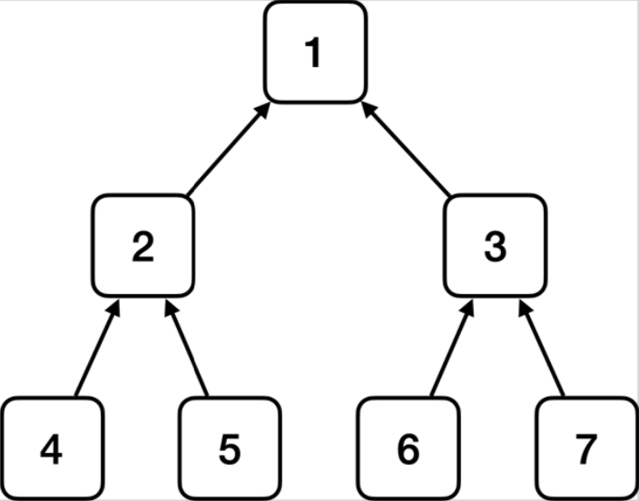
  - 1번으로 조회 결과: 1, 2, 3, 4, 5, 6, 7
  - 2번으로 조회 결과: 2, 4, 5
  - 3번으로 조회 결과: 3, 6, 7
  - 4번으로 조회 결과: 4
  - 5번으로 조회 결과: 5
  - 6번으로 조회 결과: 6
  - 7번으로 조회 결과: 7
- [ApplicationContextExtendsFindTest.java](https://github.com/k1m743hyun/spring-exercise/blob/main/core-spring/src/test/java/com/k1m743hyun/corespring/beanFind/ApplicationContextExtendsFindTest.java)


### [6] BeanFactory와 ApplicationContext
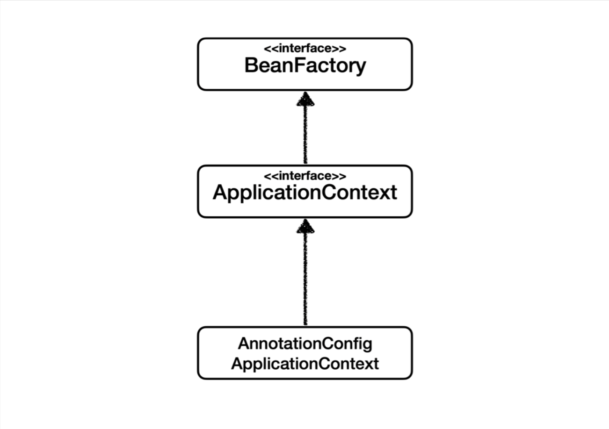


#### BeanFactory
- 스프링 컨테이너의 최상위 인터페이스
- 스프링 빈을 관리하고 조회하는 역할을 담당함
- `getBean()`을 제공함
- 지금까지 우리가 사용했던 대부분의 기능은 BeanFactory가 제공하는 기능임


#### ApplicationContext
- BeanFactory 기능을 모두 상속 받아서 제공함
- 빈을 관리하고 검색하는 기능을 BeanFactory가 제공해줌
- 애플리케이션을 개발할 때는 빈을 관리하고 조회하는 기능은 물론이고, 수 많은 부가 기능이 필요함


#### ApplicationContext가 제공하는 부가 기능
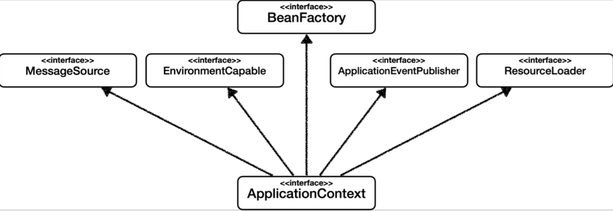
- 메세지 소스를 활용한 국제화 기능
  - 예를 들어, 한국에서 들어오면 한국어로, 영어권에서 들어오면 영어로 출력
- 환경 변수
  - 로컬, 개발, 운영 등을 구분해서 처리
- 애플리케이션 이벤트
  - 이벤트를 발행하고 구독하는 모델을 편리하게 지원
- 편리한 리소스 조회
  - 파일, 클래스 패스, 외부 등에서 리소스를 편리하게 조회


#### 정리
- ApplicationContext는 BeanFactory의 기능을 상속 받음
- ApplicationContext는 빈 관리 기능 + 편리한 부가 기능을 제공함
- BeanFactory를 직접 사용할 일은 거의 없음
- 부가 기능이 포함된 ApplicationContext를 사용함
- BeanFactory 나 ApplicationContext를 스프링 컨테이너라 함


### [7] 다양한 설정 형식 지원 - Java 코드, XML
- 스프링 컨테이너는 다양한 형식의 설정 정보를 받아드릴 수 있게 유연하게 설계되어 있음
  - Java 코드, XML, Grooby 등등

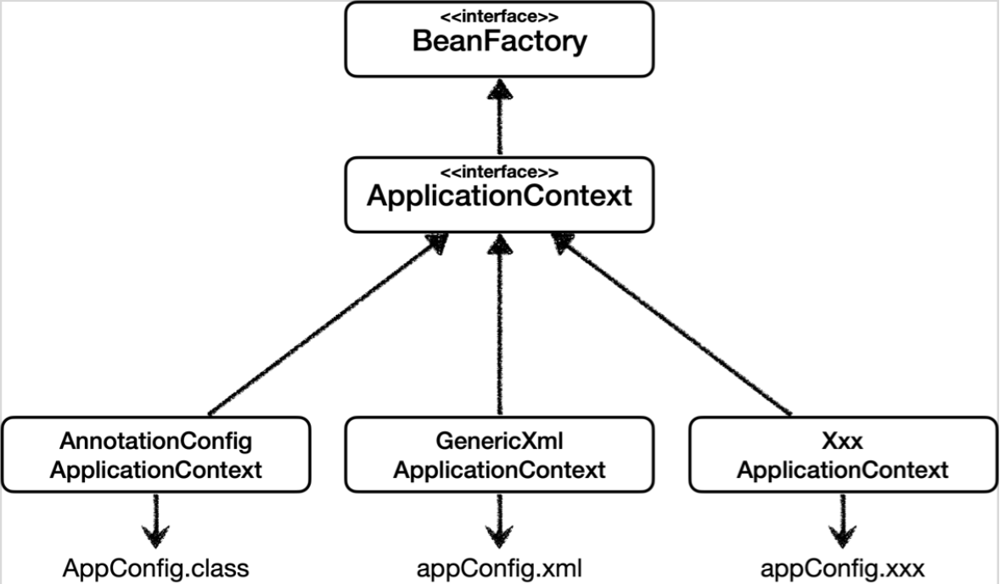


#### 애노테이션 기반 Java 코드 설정 사용
- 예제에서 사용했던 방법
- `new AnnotationConfigApplicationContext(AppConfig.class)`
- `AnnotationConfigApplicationContext` 클래스를 사용하면서 Java 코드로 괸 설정 정보를 넘기면 됨


#### XML 설정 사용
- 최근에는 스프링 부트를 많이 사용하면서 XML 기반의 설정은 잘 사용하지 않음
  - 아직은 많이 남아있는 Legacy 프로젝트들이 XML로 되어 있음
  - XML을 사용하면 컴파일 없이 빈 설정 정보를 변경할 수 있는 장점도 있음
- `GenericXmlApplicationContext`를 사용하면서 `xml` 설정 파일을 넘기면 됨


#### XmlAppConfig 사용 Java 코드
- [xmlAppConfigTest.java](https://github.com/k1m743hyun/spring-exercise/blob/main/core-spring/src/test/java/com/k1m743hyun/corespring/xml/xmlAppConfigTest.java)


#### xml 기반의 스프링 빈 설정 정보
- [appConfig.xml](https://github.com/k1m743hyun/spring-exercise/blob/main/core-spring/src/main/resources/appConfig.xml)


#### 정리
- xml 기반의 `appConfig.xml` 스프링 설정 정보와 Java 코드로 된 `AppConfig.java` 설정 정보를 비교해보면 거의 비슷하다는 것을 알 수 있음
- xml 기반으로 설정하는 것은 최근에 잘 사용하지 않으므로 이 정도로 마무리하고, 필요하면 스프링 공식 레퍼런스 문서를 확인하자
  - [https://spring.io/projects/spring-framework](https://spring.io/projects/spring-framework)


  ### [8] 스프링 빈 설정 메타 정보 - BeanDefinition
- 스프링은 어떻게 이런 다양한 설정 형식을 지원할까?
  - `BeanDefinition`이라는 추상화가 있음
- **역할과 구현을 개념적으로 나눈 것**
  - XML을 읽어서 BeanDefinition을 만들면 됨
  - Java 코드를 읽어서 BeanDefinition을 만들면 됨
  - 스프링 컨테이너는 Java 코드인지, XML인지 몰라도 됨
  - 오직 BeanDefinition만 알면 됨
- `BeanDefinition`을 빈 설정 메타 정보라 함
  - `@Bean`, `<bean>` 당 각각 하나씩 메타 정보가 생성됨
- 스프링 컨테이너는 이 메타 정보를 기반으로 스프링 빈을 생성함

- 코드 레벨로 조금 더 깊이 있게 들어가보면
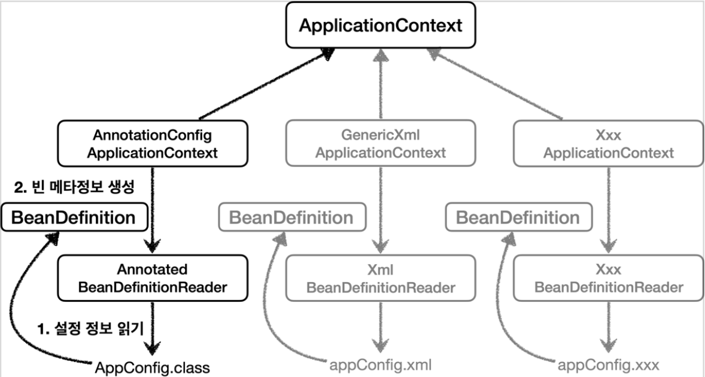
- `AnnotationConfigApplicationContext`는 `AnnotatedBeanDefinitionReader`를 사용해서 `AppConfig.class`를 읽고 `BeanDefinition`을 생성함
- `GenericXmlApplicationContext`는 `XmlBeanDefinitionReader`를 사용해서 `appConfig.xml` 설정 정보를 읽고 `BeanDefinition`을 생성함
- 새로운 형식의 설정 정보가 추가되면, XxxBeanDefinitionReader를 만들어서 `BeanDefinition`을 생성하면 됨


#### BeanDefinition 살펴보기


##### BeanDefinition 정보
- BeanClassName: 생성할 빈의 클래스 명(Java 설정처럼 팩토리 역할의 빈을 사용하면 없음)
- factoryBeanName: 팩토리 역할의 빈을 사용할 경우 이름
  - 예) appConfig
- factoryMethodName: 빈을 생성할 팩토리 메서드 지정
  - 예) memberService
- Scope: (기본값)싱글톤
- lazyInit: 스프링 컨테이너를 생성할 때 빈을 생성하는 것이 아니라, 실제 빈을 사용할 때까지 최대한 생성을 지연 처리하는지 여부
- InitMethodName: 빈을 생성하고, 의존 관계를 적용한 뒤에 호출되는 초기화 메서드 명
- DestroyMethodName: 빈의 생명주기가 끝나서 제거하기 직전에 호출되는 메서드 명
- Constructor arguments, Properties: 의존 관계 주입에서 사용함
  - Java 설정처럼 팩토리 역할의 빈을 사용하면 없음
- [BeanDefinitionTest.java](https://github.com/k1m743hyun/spring-exercise/blob/main/core-spring/src/test/java/com/k1m743hyun/corespring/beandefinition/BeanDefinitionTest.java)


#### 정리
- BeanDefinition을 직접 생성해서 스프링 컨테이너에 등록할 수도 있음
  - 하지만 실무에서 BeanDefinition을 직접 정의하거나 사용할 일은 거의 없음
- BeanDefinition에 대해서는 너무 깊이 이애하기 보다는, 스프링이 다양한 형태의 설정 정보를 BeanDefinition으로 추상화해서 사용하는 것 정도만 이해하면 됨
- 가끔 스프링 코드나 스프링 관련 오픈 소스의 코드를 볼 때, BeanDefinition이라는 것이 보일 때가 있음


## 5. 싱글톤 컨테이너


### 목차

[1] 웹 애플리케이션과 싱글톤

[2] 싱글톤 패턴

[3] 싱글톤 컨테이너

[4] 싱글톤 방식의 주의점

[5] @Configuration과 싱글톤

[6] @Configuration과 바이트코드 조작의 마법


### [1] 웹 애플리케이션과 싱글톤
- 스프링은 기업용 온라인 서비스 기술을 지원하기 위해 탄생함
- 대부분의 스프링 애플리케이션은 웹 애플리케이션임
  - 물론 웹이 아닌 애플리케이션 개발도 얼마든지 개발항 수 있음
- 웹 애플리케이션은 보통 여러 고객이 동시에 요청을 함
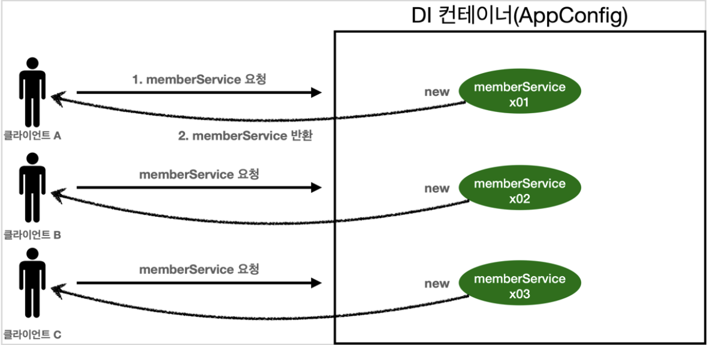


#### 스프링 없는 순수한 DI 컨테이너 테스트
- [SingletonTest.java](https://github.com/k1m743hyun/spring-exercise/blob/main/core-spring/src/test/java/com/k1m743hyun/corespring/singleton/SingletonTest.java)
- 스프링 없는 순수한 DI 컨테이너인 AppConfig는 요청할 때마다 객체를 새로 생성함
- 고객 트래픽이 초당 100이 나오면 초당 100개의 객체가 생성되고 소멸됨
  - 메모리 낭비가 심함
- 해결 방안은 해당 객체가 딱 1개만 생성되고, 공유하도록 설계하면 됨
  - 싱글톤 패턴


### [2] 싱글톤 패턴
- 클래스의 인스턴스가 딱 1개만 생성되는 것을 보장하는 디자인 패턴
- 객체 인스턴스를 2개 이상 생성되지 못 하도록 막아야 함
  - `private` 생성자를 사용해서 외부에서 임의로 `new` 키워드를 사용하지 못 하도록 막아야 함
  

#### 싱글톤 패턴을 적용한 예제 코드
- [SingletonService.java](https://github.com/k1m743hyun/spring-exercise/blob/main/core-spring/src/test/java/com/k1m743hyun/corespring/singleton/SingletonService.java)
- (1) `static` 영역에 객체 인스턴스를 미리 하나 생성해서 올려둠
- (2) 이 객체 인스턴스가 필요하면 오직 `getInstance()`메서드를 통해서만 조회할 수 있음
  - 이 메서드를 호출하면 항상 같은 인스턴스를 반환함
- (3) 딱 1개의 객체 인스턴스만 존재해야 하므로, 생성자를 `private`으로 막아서 혹시라도 외부에서 `new` 키워드로 객체 인스턴스가 생성되는 것을 막음

#### 싱글톤 패턴을 사용하는 테스트 코드
- [SingletonTest.java](https://github.com/k1m743hyun/spring-exercise/blob/main/core-spring/src/test/java/com/k1m743hyun/corespring/singleton/SingletonTest.java)
- `private`으로 `new` 키워드를 막아두었음
- 호출할 때마다 같은 객체 인스턴스를 반환하는 것을 확인할 수 있음
- 참고) 싱글톤 패턴을 구현하는 방법은 여러가지가 있음
  - 객체를 미리 생성해두는 가장 단순하고 안전한 방법을 선택함
  
- 싱글톤 패턴을 적용하면 고객의 요청이 올 때마다 객체를 생성하는 것이 아니라, 이미 만들어진 객체를 공유해서 효율적으로 사용할 수 있음
- 하지만 싱글톤 패턴은 다음과 같은 수많은 문제점을 가지고 있음


#### 싱글톤 패턴의 문제점
- 싱글톤 패턴을 구현하는 코드 자체가 많이 들어감
- 의존 관계 상 클라이언트가 구체 클래스에 의존함
  - `{구체 클래스 명}.{get 메서드 명}`로 조회해야 함
  - DIP 위반
- 클라이언트가 구체 클래스에 의존해서 OCP 원칙을 위반할 가능성이 높음
- 테스트하기 어려움
- 내부 속성을 변경하거나 초기화하기 어려움
- `private` 생성자로 자식 클래스를 만들기 어려움
- 결론적으로 유연성이 떨어짐
- 안티 패턴으로 불리기도 함


### [3] 싱글톤 컨테이너
- 스프링 컨테이너는 싱글톤 패턴을 적용하지 않아도, 객체 인스턴스를 싱글톤(1개만 생성)으로 관리함
  - 이전에 설명한 컨테이너 생성 과정을 자세히 보자
  - 컨테이너는 객체를 하나만 생성해서 관리함
- 스프링 컨테이너는 싱글톤 컨테이너 역할을 함
  - 이렇게 싱글톤 객체를 생성하고 관리하는 기능을 싱글톤 레지스트리라 함
- 스프링 컨테이너의 이런 기능 덕분에 싱글턴 패턴의 모든 단점을 해결하면서 객체를 싱글톤으로 유지할 수 있음
  - 싱글톤 패턴을 위한 지저분한 코드가 들어가지 않아도 됨
  - DIP, OCP, 테스트, `private` 생성자로부터 자유롭게 싱글톤을 사용할 수 있음


#### 스프링 컨테이너를 사용하는 테스트 코드
- [SingletonTest.java](https://github.com/k1m743hyun/spring-exercise/blob/main/core-spring/src/test/java/com/k1m743hyun/corespring/singleton/SingletonTest.java)


#### 싱글톤 컨테이너 적용 후

- 스프링 컨테이너 덕분에 고객의 요청이 올 때마다 객체를 생성하는 것이 아니라, 이미 만들어진 객체를 공유해서 효율적으로 재사용할 수 있음
- 참고) 스프링의 기본 빈 등록 방식은 싱글톤이지만, 싱글톤 방식만 지원하는 것은 아님
  - 요청할 때마나 새로운 객체를 생성해서 반환하는 기능도 제공함


### [4] 싱글톤 방식의 주의점
- 싱글톤 패턴이든, 스프링처럼 싱글톤 컨테이너를 사용하든, 객체 인스턴스를 하나만 생성해서 공유하는 싱글톤 방식은 여러 클라이언트가 하나의 같은 객체 인스턴스를 공유하기 때문에 싱글톤 객체는 상태를 유지(stateful)하게 설계하면 안됨
- 무상태(stateless)로 설계해야 함
  - 특정 클라이언트에 의존적인 필드가 있으면 안됨
  - 특정 클라이언트가 값을 변경할 수 있는 필드가 있으면 안됨
  - 가급적 읽기만 가능해야 함
  - 필드 대신에 Java에서 공유되지 않는, 지역 변수, 파라미터, ThreadLocal 등을 사용해야 함
- 스프링 빈의 필드에 공유 값을 설정하면 정말 큰 장애가 발생할 수 있음

#### 상태를 유지할 경우 발생하는 문제점
- [StatefulService.java](https://github.com/k1m743hyun/spring-exercise/blob/main/core-spring/src/test/java/com/k1m743hyun/corespring/singleton/StatefulService.java)
- [StatefulServiceTest.java](https://github.com/k1m743hyun/spring-exercise/blob/main/core-spring/src/test/java/com/k1m743hyun/corespring/singleton/StatefulServiceTest.java)
- Thread A가 A 사용자 코드를 호출하고, Thread B가 B 사용자 코드를 호출한다 가정하자
- `StatefulService`의 `price` 필드는 공유되는 필드인데, 특정 클라이언트가 값을 변경함
- A 사용자의 주문 금액은 10000원이 되어야 하는데, 20000원이라는 결과가 나옴
- 공유 필드는 조심해야 함
  - 실무에서 이런 경우를 종종 봄
  - 이로 인해 해결하기 어려운 큰 문제들이 터짐
- 스프링 빈은 항상 무상태(stateless)로 설계하자


### [5] @Configuration과 싱글톤
- [AppConfig.java](https://github.com/k1m743hyun/spring-exercise/tree/main/core-spring/src/main/java/com/k1m743hyun/corespring/AppConfig.java)
- memberService 빈을 만드는 코드를 보면 `memberRepository()`를 호출함
  - 이 메서드를 호출하면 `new MemoryMemberRepository()`를 호출함
- orderService 빈을 만드는 코드도 동일하게 `memberRepository()`를 호출함
  - 이 메서드를 호출하면 `new MemoryMemberRepository()`를 호출함
- 결과적으로 각각 다른 2개의 `MemoryMemberRepository`가 생성되면서 싱글톤이 깨지는 것처럼 보임
- 스프링 컨테이너는 이 문제를 어떻게 해결하는지 직접 테스트해보자
- 테스트를 위해 MemberRepository를 조회할 수 있는 기능 추가
- [MemberServiceImpl.java](https://github.com/k1m743hyun/spring-exercise/blob/main/core-spring/src/main/java/com/k1m743hyun/corespring/member/MemberServiceImpl.java)
- [OrderServiceImpl.java](https://github.com/k1m743hyun/spring-exercise/blob/main/core-spring/src/main/java/com/k1m743hyun/corespring/order/OrderServiceImpl.java)
- 테스트 코드
- [ConfigurationSingletonTest.java](https://github.com/k1m743hyun/spring-exercise/blob/main/core-spring/src/test/java/com/k1m743hyun/corespring/singleton/ConfigurationSingletonTest.java)
- 테스트를 실행해보면 memberRepository 인스턴스는 모두 같은 인스턴스가 공유되어 사용됨
- AppConfig의 Java 코드를 보면 분명히 각각 2번 `new MemoryMemberRepository` 호출해서 다른 인스턴스가 생성되어야 할 거 같지만 그렇지 않음
- 두 번 호출이 안되는 것이 아닌가 테스트해보자
- [AppConfig.java](https://github.com/k1m743hyun/spring-exercise/tree/main/core-spring/src/main/java/com/k1m743hyun/corespring/AppConfig.java)
- AppConfig에 호출 로그 남김
- 스프링 컨테이너가 각각 `@Bean`을 호출해서 스프링 빈을 생성함
- `memberRepository()`는 다음과 같이 총 3번 호출되어야 하는 것이 아닌가?
  - 1) 스프링 컨테이너가 스프링 빈에 등록하기 위해 `@Bean`이 붙어있는 `memberRepository()` 호출
  - 2) `memberService()` 로직에서 `memberRepository()` 호출
  - 3) `orderService()` 로직에서 `memberRepository()` 호출
  - 그런데 출력 결과는 모두 1번만 호출됨


### [6] @Configuration과 바이트코드 조작의 마법
- 스프링 컨테이너는 싱글톤 레지스트리임
- 따라서 스프링 빈이 싱글톤이 되도록 보장해주어야 함
- 그런데 스프링이 Java 코드까지 어떻게 하기는 어려움
- 그래서 스프링은 클래서의 바이트코드를 조작하는 라이브러리를 사용함
- 모든 비밀은 `@Configuration`을 적용한 `AppConfig`에 있음
- [ConfigurationSingletonTest.java](https://github.com/k1m743hyun/spring-exercise/blob/main/core-spring/src/test/java/com/k1m743hyun/corespring/singleton/ConfigurationSingletonTest.java)
- 사실 `AnnotationConfigApplicationContext`에 파라미터로 넘긴 값은 스프링 빈으로 등록됨
- 그래서 `AppConfig`도 스프링 빈이 됨
- `AppConfig` 스프링 빈을 조회해서 클래스 정보를 출력하면 아래와 같음
```
bean.getClass() = class com.k1m743hyun.corespring.AppConfig$$EnhancerBySpringCGLIB$$8218dcd7
```
- 하지만 순수 Java 클래스라면 아애와 같이 출력되어야 함
```
bean.getClass() = class com.k1m743hyun.corespring.AppConfig
```
- 예상과 다르게 클래스 명에 CGLIB이 붙으면서 상당히 복잡해진 것을 알 수 있음
- 이것은 내가 만든 클래스가 아니라 스프링이 CGLIB이라는 바이트코드 조작 라이브러리를 사용해서 `AppConfig` 클래스를 상속받은 임의의 다른 클래스를 만들고, 그 다른 클래스를 스프링 빈으로 등록한 것임
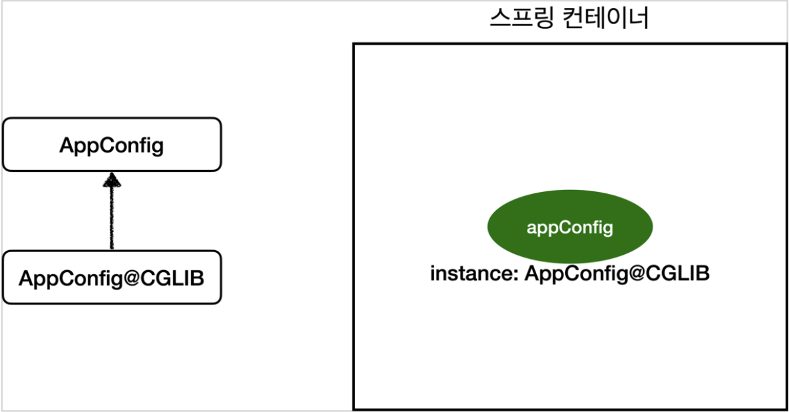
- 임의의 다른 클래스가 바로 싱글톤이  보장되도록 해줌
- 아래와 같이 바이트코드를 조작해서 작성되어 있음 것으로 예상됨
  - 실제로는 CGLIB의 내부 기술을 사용하는데는 매우 복잡함
- AppConfig@CGLIB Pseudo Code
  ```java
  @Bean
  public MemberRepository memberRepository() {
    if (memoryMemberRepository가 이미 스프링 컨테이너에 등록되어 있으면) {
      return 스프링 컨테이너에서 찾아서 반환;
    } else { // 스프링 컨테이너에 없으면
      기존 로직을 호출해서 MemoryMemberRepository를 생성하고 스프링 컨테이너에 등록
      return 반환
    }
  }
  ```
  - `@Bean`이 붙은 메서드마다 이미 스프링 빈이 존재하면 존재하는 빈을 반환하고, 스프링 빈이 없으면 생성해서 스프링 빈으로 등록하고 반환하는 코드가 동적으로 만들어짐
  - 그 덕분에 싱글톤이 보장되는 것임
  - 참고) AppConfig@CGLIB는 AppConfig의 자식 타입으로, AppConfig 타입으로 조회할 수 있음


#### `@Configuration`을 적용하지 않고, `@Bean`만 적용하면 어떻게 될까?
- `@Configuration`을 붙이면 바이트코드를 조작하는 CGLIB 기술을 사용해서 싱글톤을 보장하지만, 만약 `@Bean`만 적용하면 어떻게 될까?
- [AppConfig.java](https://github.com/k1m743hyun/spring-exercise/tree/main/core-spring/src/main/java/com/k1m743hyun/corespring/AppConfig.java)
- `@Configuration`을 주석처리하고 실행하면 AppConfig가 CGLIB 기술없이 순수한 AppConfig로 스프링 빈에 등록된 것을 확인할 수 있음
- 다른 테스트 코드를 통해 MemberRepository가 총 3번 호출된 것을 알 수 있음
  - 처음에는 `@Bean`에 의해 스프링 컨테이너에 등록하기 위한 호출
  - 나머지는 `memberRepository()`를 호출하면서 발생
- 당연히 인스턴스가 같은지 테스트하는 코드 실행 시 테스트 실패함
  - 그리고 각각 다른 MemoryMemberRepository 인스턴스를 가지고 있음


#### 정리
- `@Bean`만 사용해도 스프링 빈으로 등록되지만, 싱글톤은 보장하지 않음
  - `memoryRepository()`처럼 의존 관계 주입이 필요해서 메서드를 직접 호출할 때 싱글톤을 보장하지 않음
- 고민할 것 없이 스프링 설정 정보에는 항상 `@Configuration`을 사용하면 됨


## 6. 컴포넌트 스캔


### 목차

[1] 컴포넌트 스캔과 의존 관계 자동 주입 시작하기

[2] 탐색 위치와 기본 스캔 대상

[3] 필터

[4] 중복 등록과 충돌


### [1] 컴포넌트 스캔과 의존 관계 자동 주입 시작하기
- 스프링 빈을 등록할 때는 Java 코드의 `@Bean`이나 XML의 `<bean>` 등을 통해서 설정 정보에 직접 등록할 스프링 빈을 나열했음
- 이렇게 등록해야 할 스프링 빈이 수십, 수백개다 된다면 일일이 등록하기 귀찮고, 설정 정보 코드도 길어지고, 누락하는 문제도 발생할 수 있음
- 그래서 스프링은 설정 정보가 없어도 자동으로 스프링 빈을 등록하는 컴포넌트 스캔이라는 기능을 제공함
- 또 의존 관계도 자동으로 주입하는 `@Autowired`라는 기능도 제공함


- 컴포넌트 스캔과 의존 관계 자동 주입을 알아보자
- [AutoAppConfig.java](https://github.com/k1m743hyun/spring-exercise/tree/main/core-spring/src/main/java/com/k1m743hyun/corespring/AutoAppConfig.java)
- 컴포넌트 스캔을 사용하려면 먼저 `@ComponentScan` 어노테이션을 설정 정보에 붙여주면 됨
- 기존의 AppConfig와는 다르게 `@Bean`으로 등록한 클래스가 하나도 없다!
- 참고) 컴포넌트 스캔을 사용하면 `@Configuration` 어노테이션이 붙은 설정 정보도 자동으로 등록이 되기 때문에, 앞서 만들어두었던 AppConfig 및 TestConfig를 컴포넌트 스캔 대상에서 제외하기 위해서 `excludeFilters`를 사용함
  - 보통 설정 정보를 컨포넌트 스캔 대상에서 제외하지는 않지만, 앞서 진행했던 예제 코드를 남기기 위한 방법으로 `excludeFilters`를 사용함

- 컴포넌트 스캔은 이름 그대로 `@Component` 어노테이션이 붙은 클래스를 스캔해서 스프링 빈으로 등록함
- 참고) `@Configuration`이 컴포넌트 스캔의 대상이 되는 이유도 `@Configuration` 소스 코드를 보면 `@Component` 어노테이션이 붙어있기 때문임

- 아래 코드에 `@Component` 어노테이션 추가
- [MemoryMemberRepository.java](https://github.com/k1m743hyun/spring-exercise/blob/main/core-spring/src/main/java/com/k1m743hyun/corespring/member/MemoryMemberRepository.java)
- [RateDiscountPolicy.java](https://github.com/k1m743hyun/spring-exercise/blob/main/core-spring/src/main/java/com/k1m743hyun/corespring/discount/RateDiscountPolicy.java)
- [MemberServiceImpl.java](https://github.com/k1m743hyun/spring-exercise/blob/main/core-spring/src/main/java/com/k1m743hyun/corespring/member/MemberServiceImpl.java)
- [OrderServiceImpl.java](https://github.com/k1m743hyun/spring-exercise/blob/main/core-spring/src/main/java/com/k1m743hyun/corespring/order/OrderServiceImpl.java)

- 의존 관계를 자동으로 주입하기 위해 생성자에 `@Autowired` 어노테이션을 붙임
- [MemberServiceImpl.java](https://github.com/k1m743hyun/spring-exercise/blob/main/core-spring/src/main/java/com/k1m743hyun/corespring/member/MemberServiceImpl.java)
- [OrderServiceImpl.java](https://github.com/k1m743hyun/spring-exercise/blob/main/core-spring/src/main/java/com/k1m743hyun/corespring/order/OrderServiceImpl.java)

- 이전에는 AppConfig에서는 `@Bean`으로 직접 설정 정보를 작성했고, 의존 관계도 직접 명시했음
- 하지만 이제는 설정 정보 자체가 아예 AutoAppConfig에 없기 때문에, 의존 관계 주입도 구체 클래스 안에서 해결해야 함
- 의존 관계 주입을 자동으로 해주는 것이 `@Autowired`
  - 여러 의존 관계도 한번에 주입 받을 수 있음


- [AutoAppConfigTest.java](https://github.com/k1m743hyun/spring-exercise/blob/main/core-spring/src/test/java/com/k1m743hyun/corespring/scan/AutoAppConfigTest.java)
- `AnnotationConfigApplicationContext`를 사용하는 것은 기존과 동일함
- 설정 정보로 `AutoAppConfig` 클래스를 넘겨줌
- 실행해보고 로그를 보니 기존과 동일하게 컴포넌트 스캔이 잘 동작하는 것을 확인할 수 있음


#### `@ComponentScan`과 `@Autowired`


##### 1) `@ComponantScan`
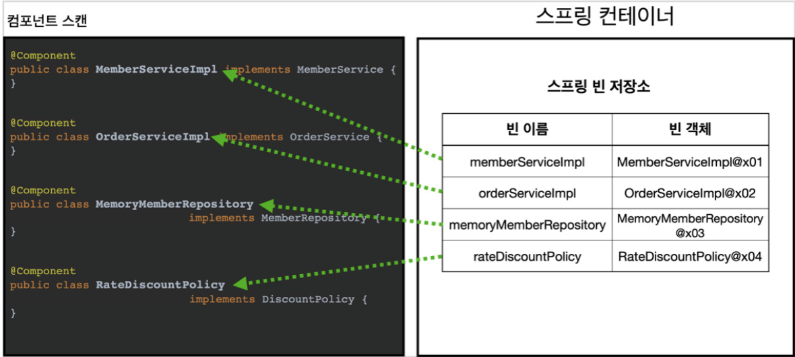
- `@ComponentScan`은 `@Component`가 붙은 모든 클래스를 스프링 빈으로 등록함
- 이때 스프링 빈의 기본 이름은 클래스 명을 사용하되 맨 앞글자만 소문자를 사용함
  - 빈 이름 기본 전략: MemberServiceImpl 클래스 => memberServiceImpl
  - 빈 이름 직접 지정: 만약 스프링 빈의 이름을 직접 지정하고 싶으면 `@Component("memberService2")` 이런 식으로 이름을 부여하면 됨


##### 2) `@Autowired` 의존 관계 자동 주입
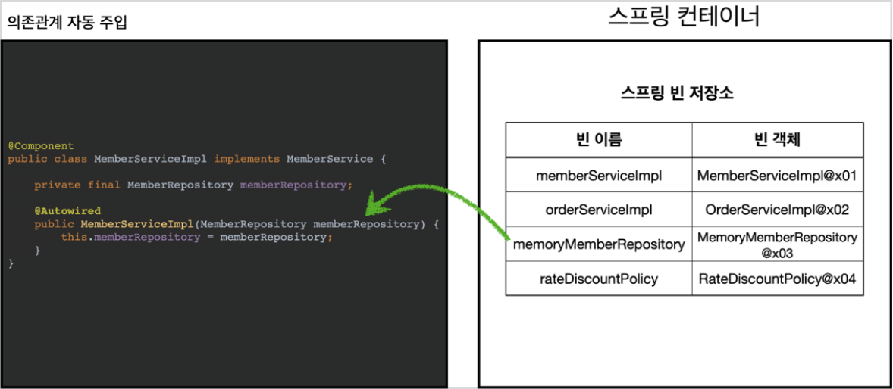
- 생성자에 `@Autowired`를 지정하면, 스프링 컨테이너가 자동으로 해당 스프링 빈을 찾아서 주입
- 이때 기본 조회 전략은 타입이 같은 빈을 찾아서 주입
  - `getBean(MemberRepository.class)`와 동일하다고 이해하면 됨


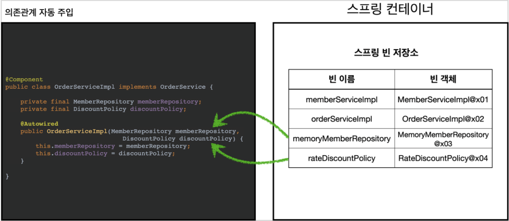
- 생성자에 파라미터가 많아도 다 찾아서 자동으로 주입


### [2] 탐색 위치와 기본 스캔 대상


#### 탐색할 패키지의 시작 위치 지정
- 모든 Java 클래스를 다 컴포넌트 스캔하면 시간이 오래 걸림
- 꼭 필요한 위치부터 탐색하도록 시작 위치를 지정할 수 있음
```
@ComponentScan(
        basePackages = "hello.core",
)
```
- `basePackages`: 탐색할 패키지의 시작 위치를 지정함
  - 이 패키지를 포함해서 하위 패키지를 모두 탐색함
  - `basePackages = {"hello.core", "hello.service"}` 이렇게 여러 시작 위치를 지정할 수도 있음
- `basePackageClasses`: 지정한 클래스의 패키지를 탐색 시작 위치로 지정함
- 만약 지정하지 않으면 `@ComponentScan`이 붙은 설정 정보 클래스의 패키지가 시작 위치가 됨


#### 권장하는 방법
- 패키지 위치를 지정하지 않고, 설정 정보 클래스의 위치를 프로젝트 최상단에 두는 것
- 스프링 부트도 이 방법을 기본으로 제공
- 예시) 프로젝트 구조가 다음과 같이 되어있음
  - `com.hello` => 프로젝트 시작 루트
  - `com.hello.service`
  - `com.hello.repository`
  - 프로젝트 시작 루트에 AppConfig 같은 메인 설정 정보를 두고, `@ComponentScan` 어노테이션을 붙이고, `basePackages` 지정은 생략함
    - 이렇게 하면 `com.hello`를 포함한 하위는 모두 자동으로 컴포넌트 스캔의 대상이 됨
    - 프로젝트 메인 설정 정보는 프로젝트를 대표하는 정보이기 때문에 프로젝트 시작 루트 위치에 두는 것이 좋음
    - 참고) Spring Boot의 대표 시작 정보인 `@SpringBootApplication`를 프로젝트 시작 루트 위치에 두는 것이 관례임
      - 이 설정 안에 `@ComponentScan`이 들어있음


#### 컴포넌트 스캔 기본 대상
- 컴포넌트 스캔은 `@Component` 뿐만 아니라 다음과 같은 내용도 추가로 대상에 포함함
  - `@Component`: 컴포넌트 스캔에서 사용
  - `@Controller`: 스프링 MVC 컨트롤러에서 사용
  - `@Service`: 스프링 비즈니스 로직에서 사용
    - 특별한 처리를 하지 않지만, 개발자들이 핵심 비즈니스 로직 위치를 인식하기 위해 도움이 됨
  - `@Repository`: 스프링 데이터 접근 계층에서 사용
    - 데이터 접근 계층의 예외를 스프링 예외로 변환해줌
  - `@Configuration`: 스프링 설정 정보에서 사용
    - 스프링 빈이 싱글톤을 유지하도록 추가 처리를 함
- 각 어노테이션의 소스 코드를 보면 `@Component`를 포함하고 있는 것을 알 수 있음
  - *Controller.java* - [org.springframework.stereotype.Controller]
  - *Service.java* - [org.springframework.stereotype.Service]
  - *Configuration.java* - [org.springframework.context.annotation.Configuration]
- 참고) 어노테이션에는 상속 관계라는 것이 없음
  - 어노테이션이 특정 어노테이션을 들고 있는 것을 인식할 수 있는 것은 Java 언어가 지원하는 기능은 아니고, 스프링이 지원하는 기능임
- 참고) `useDefaultFilters` 옵션은 기본으로 켜져 있음
- 옵션을 끄면 기본 스캔 대상들이 제외됨


### [3] 필터
- `includeFilters`: 컴포넌트 스캔 대상을 추가로 지정함
- `excludeFilters`: 컴포넌트 스캔에서 제외할 대상을 지정함


#### 컴포넌트 스캔 대상에 추가할 어노테이션
- [MyIncludeComponent.java](https://github.com/k1m743hyun/spring-exercise/blob/main/core-spring/src/test/java/com/k1m743hyun/corespring/scan/filter/MyIncludeComponent.java)


#### 컴포넌트 스캔 대상에서 제외할 어노테이션
- [MyExcludeComponent.java](https://github.com/k1m743hyun/spring-exercise/blob/main/core-spring/src/test/java/com/k1m743hyun/corespring/scan/filter/MyExcludeComponent.java)


#### 컴포넌트 스캔 대상에 추가할 클래스
- [BeanA.java](https://github.com/k1m743hyun/spring-exercise/blob/main/core-spring/src/test/java/com/k1m743hyun/corespring/scan/filter/BeanA.java)
- `@MyIncludeComponent` 적용


#### 컴포넌트 스캔 대상에서 제외할 클래스
- [BeanB.java](https://github.com/k1m743hyun/spring-exercise/blob/main/core-spring/src/test/java/com/k1m743hyun/corespring/scan/filter/BeanB.java)
- `@MyExcludeComponent` 적용


#### 설정 정보와 전체 테스트 코드
- [ComponentFilterAppConfigTest.java](https://github.com/k1m743hyun/spring-exercise/blob/main/core-spring/src/test/java/com/k1m743hyun/corespring/scan/filter/ComponentFilterAppConfigTest.java)
- `includeFilters`에 `MyIncludeComponent` 어노테이션을 추가해서 BeanA가 스프링 빈에 등록됨
- `excludeFilters`에 `MyExcludeComponent` 어노테이션을 추가해서 BeanB는 스프링 빈에 등록되지 않음


#### FilterType 옵션
- `ANNOTATION`: 기본값, 어노테이션을 인식해서 동작
  - ex) `org.example.SomeAnnotation`
- `ASSIGNABLE_TYPE`: 지정한 타입과 자식 타입을 인식해서 동작
  - ex) `org.example.SomeClass`
- `ASPECTJ`: AspectJ 패턴 사용
  - ex) `org.example..*Service+`
- `REGEX`: 정규 표현식
  - ex) `org\.example\.Default.*`
- `CUSTOM`: `TypeFilter`라는 인터페이스를 구현해서 처리
  - ex) `org.example.MyTypeFilter`


- 예시) BeanA를 제외하고 싶다면 아래 코드와 같이 진행하면 됨
```java
@ComponentScan(
      includeFilters = {
            @Filter(type = FilterType.ANNOTATION, classes = MyIncludeComponent.class),
      },
      excludeFilters = {
            @Filter(type = FilterType.ANNOTATION, classes = MyExcludeComponent.class),
            @Filter(type = FilterType.ASSIGNABLE_TYPE, classes = BeanA.class)
      }
)
```
- 참고) `@Component`면 충분하기 때문에, `includeFilters`를 사용할 일은 거의 없음
- `excludeFilters`는 여러가지 이유로 간혹 사용할 경우가 있지만, 많지는 않음
- 옵션을 변경하면서 사용하기보다는 기본 설정에 최대한 맞추어 사용하는 것을 권장함


### [4] 중복 등록과 충돌
- 컴포넌트 스캔에서 같은 빈 이름을 등록하면 어떻게 될까?
- 1) 자동 빈 등록 vs 자동 빈 등록
- 2) 수동 빈 등록 vs 자동 빈 등록


#### 1) 자동 빈 등록 vs 자동 빈 등록
- 컴포넌트 스캔에 의해 자동으로 스프링 빈이 등록되는데, 이름이 같은 경우 오류가 발생함
  - `ConflictingBeanDefinitionException` 예외 발생


#### 2) 수동 빈 등록 vs 자동 빈 등록
- 만약 수동 빈 등록과 자동 빈 등록에서 빈 이름이 충돌되면 어떻게 될까?
- [AutoAppConfig.java](https://github.com/k1m743hyun/spring-exercise/tree/main/core-spring/src/main/java/com/k1m743hyun/corespring/AutoAppConfig.java)
- [MemoryMemberRepository.java](https://github.com/k1m743hyun/spring-exercise/blob/main/core-spring/src/main/java/com/k1m743hyun/corespring/member/MemoryMemberRepository.java)
- 이런 경우에는 수동 빈 등록이 우선권을 가짐
  - 수동 빈이 자동 빈을 오버라이딩함
- 개발자가 의도적으로 원한 결과라면 자동 빈보다는 수동 빈이 우선권을 갖는 것이 맞지만
- 현실은 개발자의 의도적으로 원한 결과보다는 여러 설정들이 꼬여서 생기는 결과가 대부분 발생함
- **정말 해결하기 어려운 버그가 생성될 수 있음**
- 그래서 최근 스프링 부트 기본 설정 값은 수동 빈 등록과 자동 빈 등록이 충돌날 경우 오류가 발생하도록 함
- [CoreSpringApplication.java](https://github.com/k1m743hyun/spring-exercise/tree/main/core-spring/src/main/java/com/k1m743hyun/corespring/CoreSpringApplication.java)를 실행하면 오류가 발생하는 것을 확인할 수 있음
- 스프링 부트 에러 메세지
```
Consider renaming one of the beans or enabling overriding by setting spring.main.allow-bean-definition-overriding=true
```


## 7. 의존 관계 자동 주입


### 목차

[1] 다양한 의존 관계 주입 방법

[2] 옵션 처리

[3] 생성자 주입을 선택해라!

[4] Lombok과 최신 트렌드

[5] 조회 빈이 2개 이상 - 문제

[6] `@Autowired` 필드 명, `@Qualifier`, `@Primary`

[7] 어노테이션 직접 만들기

[8] 조회한 빈이 모두 필요할 때, List, Map

[9] 자동, 수동의 올바른 실무 운영 기준


### [1] 다양한 의존 관계 주입 방법
- 1) 생성자 주입
- 2) 수정자(Setter) 주입
- 3) 필드 주입
- 4) 일반 메서드 주입


#### 1) 생성자 주입
- 생성자를 통해서 의존 관계를 주입받는 방법
- 특징
  - 생성자 호출 시점에 딱 1번만 호출되는 것이 보장됨
  - 불변, 필수 의존 관계에 주로 사용
- [OrderServiceImpl.java](https://github.com/k1m743hyun/spring-exercise/blob/main/core-spring/src/main/java/com/k1m743hyun/corespring/order/OrderServiceImpl.java)
- 중요!) 생성자가 딱 1개만 있으면 `@Autowired`를 생략해도 자동 주입이 됨
  - 스프링 빈에만 해당됨


#### 2) 수정자(Setter) 주입
- 필드의 값을 변경하는 수정자(Setter) 메서드를 통해서 의존 관계를 주입하는 방법
- 특징
  - 선택, 변경 가능성이 있는 의존 관계에 사용
  - 자바 빈 프로퍼티 규약의 수정자 메서드 방식을 사용하는 방법
- [OrderServiceImpl.java](https://github.com/k1m743hyun/spring-exercise/blob/main/core-spring/src/main/java/com/k1m743hyun/corespring/order/OrderServiceImpl.java)
- 참고) `@Autowired`의 기본 동작은 주입할 대상이 없으면 오류가 발생함
  - 주입할 대상이 없어도 동작하게 하려면 `@Autowired(required = false))`로 지정하면 됨
- 참고) 자바 빈 프로퍼티, 자바에서는 과거부터 필드의 값을 직접 변경하지 않고, setXxx, getXxx라는 메서드를 통해서 값을 읽거나 수정하는 규칙을 만들었는데, 그것이 자바 빈 프로퍼티 규략임

##### 자바 빈 프로퍼티 규약 예시
```java
class Data {

  private int age;

  public int getAge() {
    return age;
  }

  public void setAge(int age) {
    this.age = age;
  }
}
```


#### 3) 필드 주입
- 필드에 바로 주입하는 방법
- 특징
  - 코드가 간결해서 많은 개발자들을 유혹하지만, 외부에서 변경이 불가능하므로 테스트하기 힘들다는 치명적인 단점이 있음
  - DI 프레임워크가 없으면 아무것도 할 수 없음
  - 사용하지 말자!
    - 어플리케이션의 실제 코드와 관계 없는 테스트 코드
    - 스프링 설정을 목적으로 하는 `@Configuration` 같은 곳에서만 특별한 용도로 사용
- [OrderServiceImpl.java](https://github.com/k1m743hyun/spring-exercise/blob/main/core-spring/src/main/java/com/k1m743hyun/corespring/order/OrderServiceImpl.java)
- 참고) 순수한 Java 테스트 코드에는 당연히 `@Autowired`가 동작하지 않음
  - `@SpringBootTest`처럼 스프링 컨테이너를 테스트에 통합한 경우에만 가능함
- 참고) 다음 코드와 같이 `@Bean`에서 파라미터에 의존 관계는 자동 주입됨
  - 수동 등록 시 자동 등록된 빈의 의존 관계가 필요할 때 문제를 해결할 수 있음


#### 4) 일반 메서드 주입
- 일반 메서드를 통해서 주입하는 방법
- 특징
  - 한 번에 여러 필드를 주입 받을 수 있음
  - 일반적으로 잘 사용하지 않음
- [OrderServiceImpl.java](https://github.com/k1m743hyun/spring-exercise/blob/main/core-spring/src/main/java/com/k1m743hyun/corespring/order/OrderServiceImpl.java)
- 참고) 의존 관계 자동 주입은 스프링 컨테이너가 관리하는 스프링 빈이어야 동작함
  - 스프링 빈이 아닌 클래스에서 `@Autowired` 어노테이션을 적용해도 아무런 동작을 하지 않음


### [2] 옵션 처리
- 주입할 스프링 빈이 없어도 동작해야할 때가 있지만,
  - `@Autowired`만 사용하면 `required` 옵션의 기본 값이 `true`로 되어 있기 때문에 자동 주입 대상이 없으면 오류가 발생함


#### 자동 주입 대상 옵션 처리 방법
- `@Autowired(required=false)`: 자동 주입할 대상이 없으면 수정자 메서드 자체가 호출 안된
- `org.springframework.lang.@Nullable`: 자동 주입할 대상이 없으면 null이 입력됨
- `Optional<>`: 자동 주입할 대상이 없으면 `Optional.empty`가 입력됨
- [AutowiredTest.java](https://github.com/k1m743hyun/spring-exercise/blob/main/core-spring/src/test/java/com/k1m743hyun/corespring/autowired/AutowiredTest.java)
  - **Member는 스프링 빈이 아님**
  - `setNoBean1()`은 `@Autowired(required=false)`이므로 호출 자체가 안됨
- 참고) @Nullable, Optional은 스프링 전반에 걸쳐서 지원됨
  - 생성자 자동 주입에서 특정 필드에만 사용해도 됨


### [3] 생성자 주입을 선택해라!
- 과거에는 수정자 주입과 필드 주입을 많이 사용했음
- 하지만 최근에는 스프링을 포함한 DI 프레임워크 대부분이 생성자 주입을 권장함
- 생성자 주입을 권장하는 이유는 아래와 같음


#### 불변
- 대부분의 의존 관계 주입은 한 번 일어나면 애플리케이션 종료 시점까지 의존 관계를 변경할 일이 없음
- 오히려 대부분의 의존 관계는 애플리케이션 종료 전까지 변하면 안됨(불변해야 함)
- 수정자 주입을 사용하면 setXxx 메서드를 public으로 열어두어야 함
  - 누군가 실수로 변경할 수도 있고, 변경하면 안되는 메서드를 열어두는 것을 좋은 설계 방법이 아님
- 생성자 주입은 객체를 생성할 때 딱 1번만 호출되므로 이후에 호출되는 일이 없음
  - 따라서 불변하게 설계할 수 있음


#### 누락
- 프레임워크 없이 순수한 Java 코드를 단위 테스트하는 경우


##### 1) 수정자 의존 관계인 경우
- [OrderServiceImpl.java](https://github.com/k1m743hyun/spring-exercise/blob/main/core-spring/src/main/java/com/k1m743hyun/corespring/order/OrderServiceImpl.java)
- `@Autowired`가 프레임워크 안에서 동작할 때는 의존 관계가 없으면 오류가 발생하지만, 지금은 프레임워크없이 순수한 Java 코드로만 단위 테스트를 수행하고 있음
- [OrderServiceImplTest.java](https://github.com/k1m743hyun/spring-exercise/blob/main/core-spring/src/test/java/com/k1m743hyun/corespring/order/OrderServiceImplTest.java)
- 테스트를 수행하면 실행은 되지만, 막상 실행 결과는 NPE(NullPointerException)이 발생하는데, memberRepository, discountPolicy 모두 의존 관계 주입이 누락되었기 때문


##### 2) 생성자 주입을 사용한 경우
- 주입 데이터가 누락되었을 때 **컴파일 오류**가 발생함
- IDE에서 어떤 값이 필수로 주입되어야 하는지 알 수 있음
- [OrderServiceImplTest.java](https://github.com/k1m743hyun/spring-exercise/blob/main/core-spring/src/test/java/com/k1m743hyun/corespring/order/OrderServiceImplTest.java)


#### final 키워드
- 생성자 주입을 사용하면 필드에 `final` 키워드를 사용할 수 있음
- 생성자에 혹시라도 값이 설정되지 않은 오류를 컴파일 시점에 막아줌
- [OrderServiceImpl.java](https://github.com/k1m743hyun/spring-exercise/blob/main/core-spring/src/main/java/com/k1m743hyun/corespring/order/OrderServiceImpl.java)
- 필수 필드인 `discountPolicy`에 값을 설정해야 하는데, 이 부분이 누락되었음
- Java는 컴파일 시점에 다음 오류를 발생시킴
  - `java: variable discountPolicy might not have been initialized`
- **컴파일 오류는 세상에서 가장 빠르게 확인할 수 있는 좋은 오류다!**
- 참고) 수정자 주입을 포함한 나머지 주입 방식은 모두 생성자 이후에 호출되므로, 필드에 `final` 키워드를 사용할 수 없음
  - 오직 생성자 주입 방식만 `final` 키워드를 사용할 수 있음


#### 정리
- 생성자 주입 방식을 선택하는 이유는 여러가지가 있지만, 프레임워크에 의존하지 않고, 순수한 Java 언어의 특징을 잘 살리는 방법이기도 함
- 기본으로 생성자 주입을 사용하고, 필수 값이 아닌 경우에는 수정자 주입 방식을 옵션으로 부여하면 됨
  - 생성자 주입과 수정자 주입을 동시에 사용할 수 있음
  - 필드 주입은 사용하지 않는 것이 좋음


### [4] Lombok과 최신 트렌드
- 개발을 해보면 대부분이 불변이기에 필드에 `final` 키워드를 사용하게 됨
- 그런데 생성자도 만들어야 하고, 주입받은 값을 대입하는 코드도 만들어야 하고...
- 필드 주입처럼 편리하게 사용하는 방법이 없을까?


#### Lombok 라이브러리 적용 방법
- [build.gradle](https://github.com/k1m743hyun/spring-exercise/blob/main/core-spring/build.gradle)
- 1> Settings => Plugins => Marketplace에서 Lombok 검색 설치 실행 => Intellij 재시작
- 2> Settings => Build, Execution, Deployment => Compiler => Annotation Processors => Enable annotation processing 활성화 => Intellij 재시작
- [HelloLombok.java](https://github.com/k1m743hyun/spring-exercise/blob/main/core-spring/src/main/java/com/k1m743hyun/corespring/HelloLombok.java)
  - Lombok 라이브러리가 제공하는 `@Getter`, `@Setter`, `@ToString` 기능을 사용할 수 있음


#### 기존 코드에 Lombok 적용하기
- [OrderServiceImpl.java](https://github.com/k1m743hyun/spring-exercise/blob/main/core-spring/src/main/java/com/k1m743hyun/corespring/order/OrderServiceImpl.java)
- `@RequiredArgsConstructor` 기능을 사용하면 `final`이 붙은 필드를 모아서 생성자를 자동으로 만들어줌
  - 코드 상에는 보이지 않지만 실제 호출이 가능함
- Lombok이 Java의 어노테이션 프로세서라는 기능을 이용해서 컴파일 시점에 생성자 코드를 자동으로 생성해줌


#### 정리
- 최근에 생성자를 딱 1개 두고 `@Autowired`를 생략하는 방법을 주로 사용함
- Lombok 라이브러리의 `@RequiredArgsConstructor`를 사용하면 기존 코드와 실행은 같지만 코드가 간결해짐